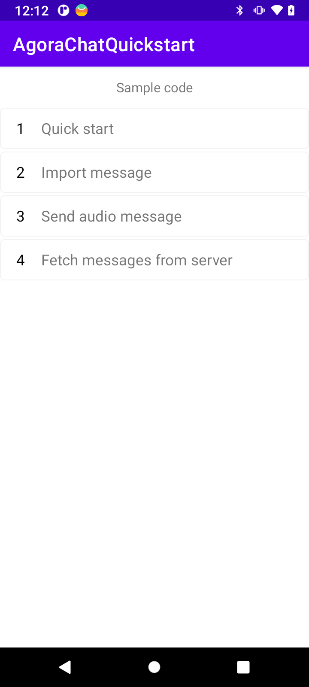

# API Example Android

_English | [中文](README.zh.md)_

## Overview

This repository contains sample projects using the Agora Chat Java SDK for Android .



## Project structure

The project uses a single app to combine a variety of functionalities.Each function is loaded as a activity for you to play with.

| Function                                                                        | Location                                                                                                                                 |
| ------------------------------------------------------------------------------- | ---------------------------------------------------------------------------------------------------------------------------------------- |
| Get Started with Agora Chat                                    | [MainActivity.java](https://github.com/AgoraIO/Agora-Chat-API-Examples/blob/main/Chat-Android/app/src/main/java/io/agora/agorachatquickstart/MainActivity.java)                  |
| Pull historical messages from Chat Server                               | [FetchMessagesFromServerActivity.java](https://github.com/AgoraIO/Agora-Chat-API-Examples/blob/main/Chat-Android/app/src/main/java/io/agora/agorachatquickstart/FetchMessagesFromServerActivity.java)                  |
| Import third-party messages                                    | [ImportMessagesActivity.java](https://github.com/AgoraIO/Agora-Chat-API-Examples/blob/main/Chat-Android/app/src/main/java/io/agora/agorachatquickstart/ImportMessagesActivity.java)                  |
| Send voice message                                     | [SendAudioMessageActivity.java](https://github.com/AgoraIO/Agora-Chat-API-Examples/blob/main/Chat-Android/app/src/main/java/io/agora/agorachatquickstart/SendAudioMessageActivity.java)                  |
| Get Started with Agora Chat UIKit                              | [chatuikitquickstart/MainActivity.java](https://github.com/AgoraIO/Agora-Chat-API-Examples/blob/main/Chat-Android/chatuikitquickstart/src/main/java/io/agora/chatuikitquickstart/MainActivity.java)                  |

## How to run the sample project

### Prerequisites

*Necessary requirements for the project to run.*

- Physical Android device or Android simulator with Android 5.0+
- Android Studio (latest version recommended)
- JDK (1.8+)

### Steps to run

*Steps from cloning the code to running the project*

1. Clone this project to local
2. In Android Studio, open `/Chat-Android/`.
3. Sync the project with Gradle files.
4. If you want to use your own App Key for the experience, you can edit the `Chat-Android/app/src/main/res/values/strings.xml` file.
   - Replace `YOUR APP KEY` with your App KEY.
   - Replace `YOUR LOGIN URL` with the address of the App Server you built to get Agora Chat Token.
   - Replace `YOUR REGISTER USER URL` with the address of the registered Agora Chat user on the App Server you built.
   ```xml
   <string name="app_key">YOUR APP KEY</string>
   <string name="login_url">YOUR LOGIN URL</string>
   <string name="register_url">YOUR REGISTER URL</string>
   ```

   > See [Enable and Configure Agora Chat Service](https://docs.agora.io/en/agora-chat/enable_agora_chat?platform=Android) to learn how to enable and configure Agora Chat Service.
   
   > Refer to the source code [Chat App Server](https://github.com/AgoraIO/Agora-Chat-API-Examples/tree/main/chat-app-server) to learn how to quickly build an App Server.


4. Make the project and run the app in the simulator or connected physical Android device.

You are all set! Feel free to play with this sample project and explore features of the Agora Chat Java SDK.


## Feedback

If you have any problems or suggestions regarding the sample projects, feel free to file an issue.

## Reference

- [Agora Chat Overview](https://docs.agora.io/en/agora-chat/agora_chat_overview?platform=Android)
- [API Reference]()

## Related resources

- Check our [FAQ](https://docs.agora.io/en/faq) to see if your issue has been recorded.
- Dive into [Agora SDK Samples](https://github.com/AgoraIO) to see more tutorials
- Take a look at [Agora Use Case](https://github.com/AgoraIO-usecase) for more complicated real use case
- Repositories managed by developer communities can be found at [Agora Community](https://github.com/AgoraIO-Community)
- If you encounter problems during integration, feel free to ask questions in [Stack Overflow](https://stackoverflow.com/questions/tagged/agora.io)

## License

The sample projects are under the MIT license.
