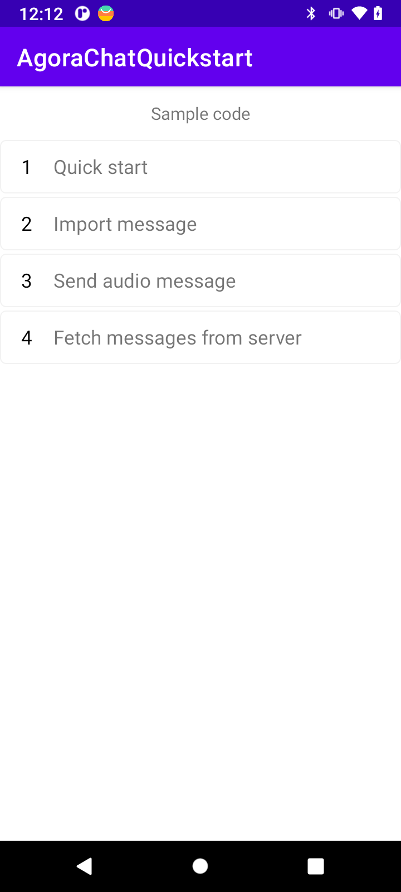

# API Example Android

_[English](README.md) | 中文_

## 简介

该仓库包含了使用 Agora Chat Java SDK for Android 的示例项目。



## 项目结构

此项目使用一个单独的 app 实现了多种功能。每个功能以 activity 的形式加载，方便你进行试用。

| 功能                                             | 位置                                                                                                                    |
| ------------------------------------------------ | ----------------------------------------------------------------------------------------------------------------------- |
| 基于 Agora Chat 的快速开始                                    | [MainActivity.java](https://github.com/AgoraIO/Agora-Chat-API-Examples/blob/main/Chat-Android/app/src/main/java/io/agora/agorachatquickstart/MainActivity.java)                  |
| 从服务器拉取历史消息                               | [FetchMessagesFromServerActivity.java](https://github.com/AgoraIO/Agora-Chat-API-Examples/blob/main/Chat-Android/app/src/main/java/io/agora/agorachatquickstart/FetchMessagesFromServerActivity.java)                  |
| 导入第三方消息                                    | [ImportMessagesActivity.java](https://github.com/AgoraIO/Agora-Chat-API-Examples/blob/main/Chat-Android/app/src/main/java/io/agora/agorachatquickstart/ImportMessagesActivity.java)                  |
| 发送语音消息                                     | [SendAudioMessageActivity.java](https://github.com/AgoraIO/Agora-Chat-API-Examples/blob/main/Chat-Android/app/src/main/java/io/agora/agorachatquickstart/SendAudioMessageActivity.java)                  |
| 基于 Agora Chat UIKit 的快速开始                  | [chatuikitquickstart/MainActivity.java](https://github.com/AgoraIO/Agora-Chat-API-Examples/blob/main/Chat-Android/chatuikitquickstart/src/main/java/io/agora/chatuikitquickstart/MainActivity.java)                  |


## 如何运行示例项目

### 前提条件


- 真实的 Android 设备或 Android 虚拟机
- Android Studio (推荐最新版)
- JDK (1.8以上)

### 运行步骤

1. 克隆本项目到本地
2. 在 Android Studio 中，打开 /Chat-Android/。
3. 将项目与 Gradle 文件同步。
4. 如果你想使用自己的 App Key 进行体验，你可以编辑 `Chat-Android/app/src/main/res/values/strings.xml` 文件。
   - 将 `YOUR APP KEY` 替换为你的 App Key。
   - 将 `YOUR LOGIN URL` 替换为你搭建的 App Server 获取 Agora Chat Token 的地址。
   - 将 `YOUR REGISTER USER URL` 替换为你搭建的 App Server 注册 Agora Chat 用户的地址。
      ```xml
      <string name="app_key">YOUR APP KEY</string>
      <string name="login_url">YOUR LOGIN URL</string>
      <string name="register_url">YOUR REGISTER URL</string>
      ```
   

   > 参考 [开启和配置即时通讯服务](https://docs.agora.io/cn/agora-chat/enable_agora_chat?platform=Android) 了解如何开启并配置即时通讯服务。

   > 参考源码 [Chat App Server](https://github.com/AgoraIO/Agora-Chat-API-Examples/tree/main/chat-app-server) 了解如何快速搭建 App Server。
   

5. 构建项目，在虚拟器或真实 Android 设备中运行项目。

一切就绪。你可以自由探索示例项目，体验 SDK 的丰富功能。

## 反馈

如果你有任何问题或建议，可以通过 issue 的形式反馈。

## 参考文档

- [Agora Chat SDK 产品概述](https://docs.agora.io/cn/agora-chat/agora_chat_overview?platform=Android)
- [Agora Chat SDK API 参考](https://api-ref.agora.io/en/chat-sdk/android/1.x/annotated.html)

## 相关资源

- 你可以先参阅[常见问题](https://docs.agora.io/cn/faq)
- 如果你想了解更多官方示例，可以参考[官方 SDK 示例](https://github.com/AgoraIO)
- 如果你想了解声网 SDK 在复杂场景下的应用，可以参考[官方场景案例](https://github.com/AgoraIO-usecase)
- 如果你想了解声网的一些社区开发者维护的项目，可以查看[社区](https://github.com/AgoraIO-Community)
- 若遇到问题需要开发者帮助，你可以到[开发者社区](https://rtcdeveloper.com/)提问
- 如果需要售后技术支持, 你可以在[Agora Dashboard](https://dashboard.agora.io)提交工单

## 代码许可

示例项目遵守 MIT 许可证。
