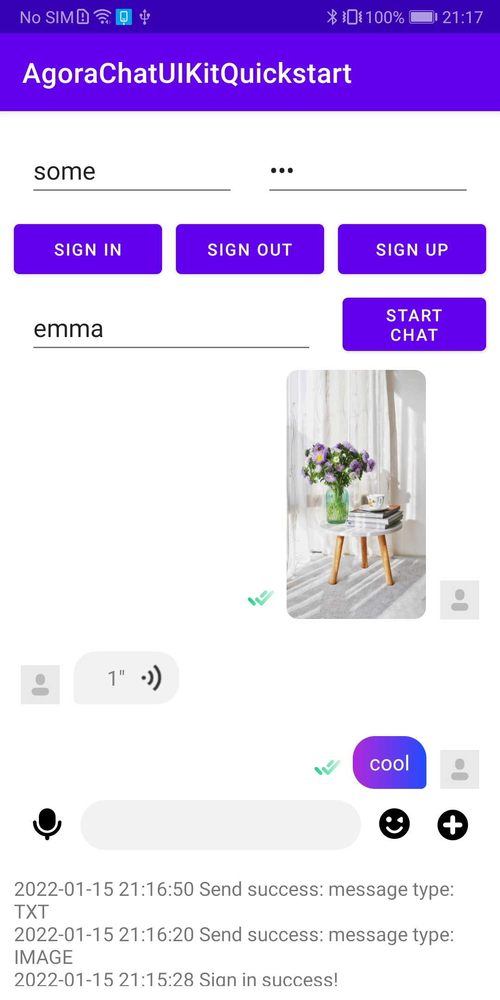

# 快速发送 Agora Chat 消息

本文详细介绍基于 Agora Chat Android UIKit 如何快速实现消息的发送。

## 消息发送与接收流程
// todo 需要增加一张流程图

登录 Agora Chat 系统包括以下流程：
1. 客户端使用帐号和密码在 App Server 上注册。
2. 客户端注册成功后，使用账号和密码从  App Server 中获取 Token 。
3. 客户端使用账号和 Token 登录到 Chat 服务器。

// todo 需要增加一张流程图

发送和接收点对点消息包括以下流程：
1. 客户端 A 发送点对点消息到 Chat 服务器。
2. Chat 服务器将消息发送到客户端 B。客户端 B 收到点对点消息。

## 前提条件
 - 安装 Android 4.4+ 及以上版本操作系统的 Android 模拟器或真实设备。
 - Android Studio 3.2或更高版本。
 - Android SDK (版本取决于目标平台)。
 - Java Development Kit (JDK)，版本选择参考 Android 官方文档。
 - 有效的 Agora Chat 开发者账号。
 - 在控制台创建 Agora Chat 项目并获取 App Key 。//todo 增加跳转链接

 ## 建立项目

按照如下步骤配置使用 Agora Chat Android UIKit 的项目环境。
 ### 1.创建 Android 项目

 使用 Android Studio 创建一个 [Android 项目](https://developer.android.google.cn/studio/projects/create-project)。

- Project Template 选择 Empty Activity。
- Name 设为 AgoraChatUIKitQuickstart。
- Package name 设为 io.agora.chatuikitquickstart。
- Language 选择 Java。

### 2.集成 Agora Chat SDK

将 Agora Chat SDK 集成到你的项目中。

在项目根目录的 build.gradle 文件中添加 MavenCentral 远程仓库。

```java
buildscript {
    repositories {
        ...
        mavenCentral()
    }
}
allprojects {
    repositories {
        ...
        mavenCentral()
    }
}
```

在项目的 /app/build.gradle 文件添加 io.agora.rtc:chat-uikit 依赖项（X.Y.Z 为当前版本号）。你可以在 [Sonatype](https://search.maven.org/) 官网查询最新版本号。

```java
android {
    
    compileOptions {
        sourceCompatibility JavaVersion.VERSION_1_8
        targetCompatibility JavaVersion.VERSION_1_8
    }
}

dependencies {
    ...
        implementation 'io.agora.rtc:chat-uikit:X.Y.Z'
}
```
### 3.防止代码混淆

在 app/proguard-rules.pro 文件中添加如下行，防止代码混淆：
```java
-keep class io.agora.** {*;}
-dontwarn  io.agora.**
```

### 4.添加权限

在 AndroidManifest.xml 中添加以下权限：
```xml
<uses-permission android:name="android.permission.INTERNET" />
<uses-permission android:name="android.permission.ACCESS_NETWORK_STATE"/>
<uses-permission android:name="android.permission.WAKE_LOCK"/>
<uses-permission android:name="android.permission.READ_EXTERNAL_STORAGE"/>
<uses-permission android:name="android.permission.WRITE_EXTERNAL_STORAGE"/>
<uses-permission android:name="android.permission.CAMERA"/>
<uses-permission android:name="android.permission.RECORD_AUDIO"/>
```
>注意：
以上权限为保证项目运行的最基本要求，随着功能的增加，你需要根据项目情况增加必要的权限。
## 项目实现

下文主要描述如何基于 AgoraChatUIKit 实现消息发送。
### 1.创建用户界面

为了帮助你快速实现并理解相关功能，本文通过最简方式，在一个 Activity 里实现以下操作：

- 注册，登录和退出；
- 发送消息。

1. 打开 app/res/layout/activity_main.xml 并将文件内容替换为以下 XML 代码：
```xml
<?xml version="1.0" encoding="utf-8"?>
<LinearLayout xmlns:android="http://schemas.android.com/apk/res/android"
    xmlns:app="http://schemas.android.com/apk/res-auto"
    xmlns:tools="http://schemas.android.com/tools"
    android:layout_width="match_parent"
    android:layout_height="match_parent"
    android:orientation="vertical"
    tools:context=".MainActivity">

    <androidx.constraintlayout.widget.ConstraintLayout
        android:layout_width="match_parent"
        android:layout_height="0dp"
        android:layout_weight="1">

        <EditText
            android:id="@+id/et_username"
            android:layout_width="0dp"
            android:layout_height="wrap_content"
            android:hint="@string/enter_username"
            app:layout_constraintLeft_toLeftOf="parent"
            app:layout_constraintRight_toLeftOf="@id/et_pwd"
            app:layout_constraintTop_toTopOf="parent"
            android:layout_marginStart="20dp"
            android:layout_marginEnd="20dp"
            android:layout_marginTop="20dp"/>

        <EditText
            android:id="@+id/et_pwd"
            android:layout_width="0dp"
            android:layout_height="wrap_content"
            android:hint="@string/enter_password"
            android:inputType="textPassword"
            app:layout_constraintLeft_toRightOf="@id/et_username"
            app:layout_constraintRight_toRightOf="parent"
            app:layout_constraintTop_toTopOf="@id/et_username"
            android:layout_marginEnd="20dp"/>

        <Button
            android:id="@+id/btn_sign_in"
            android:layout_width="0dp"
            android:layout_height="wrap_content"
            android:textSize="12sp"
            android:text="@string/sign_in"
            android:onClick="signInWithToken"
            app:layout_constraintLeft_toLeftOf="parent"
            app:layout_constraintTop_toBottomOf="@id/et_pwd"
            app:layout_constraintRight_toLeftOf="@id/btn_sign_out"
            android:layout_marginStart="10dp"
            android:layout_marginEnd="5dp"
            android:layout_marginTop="10dp"/>

        <Button
            android:id="@+id/btn_sign_out"
            android:layout_width="0dp"
            android:layout_height="wrap_content"
            android:textSize="12sp"
            android:text="@string/sign_out"
            android:onClick="signOut"
            app:layout_constraintLeft_toRightOf="@id/btn_sign_in"
            app:layout_constraintTop_toBottomOf="@id/et_pwd"
            app:layout_constraintRight_toLeftOf="@id/btn_sign_up"
            android:layout_marginStart="5dp"
            android:layout_marginEnd="5dp"
            android:layout_marginTop="10dp"/>

        <Button
            android:id="@+id/btn_sign_up"
            android:layout_width="0dp"
            android:layout_height="wrap_content"
            android:text="@string/sign_up"
            android:textSize="12sp"
            android:onClick="signUp"
            app:layout_constraintLeft_toRightOf="@id/btn_sign_out"
            app:layout_constraintRight_toRightOf="parent"
            app:layout_constraintTop_toBottomOf="@id/et_pwd"
            app:layout_constraintTop_toTopOf="@id/btn_sign_in"
            android:layout_marginStart="5dp"
            android:layout_marginEnd="10dp"/>

        <EditText
            android:id="@+id/et_to_username"
            android:layout_width="0dp"
            android:layout_height="wrap_content"
            android:hint="@string/enter_to_username"
            app:layout_constraintLeft_toLeftOf="parent"
            app:layout_constraintRight_toLeftOf="@id/btn_start_chat"
            app:layout_constraintTop_toBottomOf="@id/btn_sign_up"
            app:layout_constraintHorizontal_weight="2"
            android:layout_marginStart="20dp"
            android:layout_marginEnd="20dp"
            android:layout_marginTop="10dp"
            android:layout_marginBottom="10dp"/>

        <Button
            android:id="@+id/btn_start_chat"
            android:layout_width="0dp"
            android:layout_height="wrap_content"
            android:text="@string/start_chat"
            android:onClick="startChat"
            android:textSize="12sp"
            app:layout_constraintLeft_toRightOf="@id/et_to_username"
            app:layout_constraintRight_toRightOf="parent"
            app:layout_constraintBottom_toBottomOf="@id/et_to_username"
            app:layout_constraintHorizontal_weight="1"
            android:layout_marginEnd="10dp"/>

        <FrameLayout
            android:id="@+id/fl_fragment"
            android:layout_width="match_parent"
            android:layout_height="0dp"
            app:layout_constraintLeft_toLeftOf="parent"
            app:layout_constraintRight_toRightOf="parent"
            app:layout_constraintTop_toBottomOf="@id/btn_start_chat"
            app:layout_constraintBottom_toBottomOf="parent"/>

    </androidx.constraintlayout.widget.ConstraintLayout>

    <TextView
        android:id="@+id/tv_log"
        android:layout_width="match_parent"
        android:layout_height="100dp"
        android:hint="@string/log_hint"
        android:scrollbars="vertical"
        android:padding="10dp"/>

</LinearLayout>
```
2. 打开 app/res/values/strings.xml 并将内容替换为以下 XML 代码：

```java
<resources>
    <string name="app_name">AgoraChatUIKitQuickstart</string>

    <string name="username_or_pwd_miss">Username or password is empty</string>
    <string name="sign_up_success">Sign up success!</string>
    <string name="sign_in_success">Sign in success!</string>
    <string name="sign_out_success">Sign out success!</string>
    <string name="send_message_success">Send message success!</string>
    <string name="enter_username">Enter username</string>
    <string name="enter_password">Enter password</string>
    <string name="sign_in">Sign in</string>
    <string name="sign_out">Sign out</string>
    <string name="sign_up">Sign up</string>
    <string name="enter_to_username">Enter to username</string>
    <string name="start_chat">Start chat</string>
    <string name="enter_content">Enter content</string>
    <string name="log_hint">Show log area...</string>
    <string name="has_login_before">An account has been signed in, please sign out first and then sign in</string>
    <string name="sign_in_first">Please sign in first</string>
    <string name="not_find_send_name">Please enter the username who you want to send first!</string>

    <string name="app_key">Your App Key</string>
</resources>
```

你需要编辑以下字段：

- 将 "Your App Key" 替换为你的 [App Key](//todo 跳转到声网控制台)) 。
- 在本示例中，你可以使用默认 App Key（41117440#383391）进行体验，正式开发环境需注册和使用你的 [App Key](https://docs.agora.io/cn/AgoraPlatform/sign_in_and_sign_up)。

**注意**
>如果你已经搭建了获取鉴权 Token 的 App Server，你需要将 Your App Key 替换为你的  App Key 。
### 2.实现消息发送与接收

1. 打开 app/java/io.agora.chatuikitquickstart/MainActivity.java 并将内容替换为以下 Java 代码：

```java
package io.agora.chatuikitquickstart;

import android.Manifest;
import android.os.Bundle;
import android.text.TextUtils;
import android.text.method.ScrollingMovementMethod;
import android.view.MotionEvent;
import android.view.View;
import android.widget.EditText;
import android.widget.TextView;
import android.widget.Toast;

import androidx.appcompat.app.AppCompatActivity;
import androidx.core.content.ContextCompat;

import org.json.JSONObject;

import java.util.HashMap;
import java.util.Map;

import io.agora.CallBack;
import io.agora.ConnectionListener;
import io.agora.Error;
import io.agora.chat.ChatClient;
import io.agora.chat.ChatMessage;
import io.agora.chat.ChatOptions;
import io.agora.chat.uikit.EaseUIKit;
import io.agora.chat.uikit.chat.EaseChatFragment;
import io.agora.chat.uikit.chat.interfaces.OnChatExtendMenuItemClickListener;
import io.agora.chat.uikit.chat.interfaces.OnChatInputChangeListener;
import io.agora.chat.uikit.chat.interfaces.OnChatRecordTouchListener;
import io.agora.chat.uikit.chat.interfaces.OnMessageSendCallBack;
import io.agora.chatuikitquickstart.utils.LogUtils;
import io.agora.chatuikitquickstart.utils.PermissionsManager;
import io.agora.cloud.HttpClientManager;
import io.agora.cloud.HttpResponse;
import io.agora.util.EMLog;

import static io.agora.cloud.HttpClientManager.Method_POST;


public class MainActivity extends AppCompatActivity {
    private static final String NEW_LOGIN = "NEW_LOGIN";
    private static final String RENEW_TOKEN = "RENEW_TOKEN";
    private static final String LOGIN_URL = "https://a41.easemob.com/app/chat/user/login";
    private static final String REGISTER_URL = "https://a41.easemob.com/app/chat/user/register";
    private EditText et_username;
    private TextView tv_log;
    private ConnectionListener connectionListener;

    @Override
    protected void onCreate(Bundle savedInstanceState) {
        super.onCreate(savedInstanceState);
        setContentView(R.layout.activity_main);
        initView();
        requestPermissions();
        initSDK();
        addConnectionListener();
    }

    private void initView() {
        et_username = findViewById(R.id.et_username);
        tv_log = findViewById(R.id.tv_log);
        tv_log.setMovementMethod(new ScrollingMovementMethod());
    }

    private void requestPermissions() {
        checkPermissions(Manifest.permission.WRITE_EXTERNAL_STORAGE, 110);
    }

//=================== init SDK start ========================
    private void initSDK() {
        ChatOptions options = new ChatOptions();
        // Set your appkey applied from Agora Console
        String sdkAppkey = getString(R.string.app_key);
        if(TextUtils.isEmpty(sdkAppkey)) {
            Toast.makeText(MainActivity.this, "You should set your AppKey first!", Toast.LENGTH_SHORT).show();
            return;
        }
        // Set your appkey to options
        options.setAppKey(sdkAppkey);
        // Set whether confirmation of delivery is required by the recipient. Default: false
        options.setRequireDeliveryAck(true);
        // Set not to log in automatically
        options.setAutoLogin(false);
        // Use uikit to initialize Agora Chat SDK
        EaseUIKit.getInstance().init(this, options);
        // Make Agora Chat SDK debuggable
        ChatClient.getInstance().setDebugMode(true);
    }
//=================== init SDK end ========================
//================= SDK listener start ====================
    private void addConnectionListener() {
        connectionListener = new ConnectionListener() {
            @Override
            public void onConnected() {
            }

            @Override
            public void onDisconnected(int error) {
                if (error == Error.USER_REMOVED) {
                    onUserException("account_removed");
                } else if (error == Error.USER_LOGIN_ANOTHER_DEVICE) {
                    onUserException("account_conflict");
                } else if (error == Error.SERVER_SERVICE_RESTRICTED) {
                    onUserException("account_forbidden");
                } else if (error == Error.USER_KICKED_BY_CHANGE_PASSWORD) {
                    onUserException("account_kicked_by_change_password");
                } else if (error == Error.USER_KICKED_BY_OTHER_DEVICE) {
                    onUserException("account_kicked_by_other_device");
                } else if(error == Error.USER_BIND_ANOTHER_DEVICE) {
                    onUserException("user_bind_another_device");
                } else if(error == Error.USER_DEVICE_CHANGED) {
                    onUserException("user_device_changed");
                } else if(error == Error.USER_LOGIN_TOO_MANY_DEVICES) {
                    onUserException("user_login_too_many_devices");
                }
            }

            @Override
            public void onTokenExpired() {
                //login again
                signInWithToken(null);
                LogUtils.showLog(tv_log,"ConnectionListener onTokenExpired");
            }

            @Override
            public void onTokenWillExpire() {
                getTokenFromAppServer(RENEW_TOKEN);
                LogUtils.showLog(tv_log, "ConnectionListener onTokenWillExpire");
            }
        };
        // Call removeConnectionListener(connectionListener) when the activity is destroyed
        ChatClient.getInstance().addConnectionListener(connectionListener);
    }

//================= SDK listener end ====================
//=================== click event start ========================

    /**
     * Sign up with username and password.
     */
    public void signUp(View view) {
        String username = et_username.getText().toString().trim();
        String pwd = ((EditText) findViewById(R.id.et_pwd)).getText().toString().trim();
        if(TextUtils.isEmpty(username) || TextUtils.isEmpty(pwd)) {
            LogUtils.showErrorToast(this, tv_log, getString(R.string.username_or_pwd_miss));
            return;
        }
        execute(()-> {
            try {
                Map<String, String> headers = new HashMap<>();
                headers.put("Content-Type", "application/json");
                JSONObject request = new JSONObject();
                request.putOpt("userAccount", username);
                request.putOpt("userPassword", pwd);

                LogUtils.showErrorLog(tv_log,"begin to signUp...");

                HttpResponse response = HttpClientManager.httpExecute(REGISTER_URL, headers, request.toString(), Method_POST);
                int code=  response.code;
                String responseInfo = response.content;
                if (code == 200) {
                    if (responseInfo != null && responseInfo.length() > 0) {
                        JSONObject object = new JSONObject(responseInfo);
                        String resultCode = object.getString("code");
                        if(resultCode.equals("RES_OK")) {
                            LogUtils.showToast(MainActivity.this, tv_log, getString(R.string.sign_up_success));
                        }else{
                            String errorInfo = object.getString("errorInfo");
                            LogUtils.showErrorLog(tv_log,errorInfo);
                        }
                    } else {
                        LogUtils.showErrorLog(tv_log,responseInfo);
                    }
                } else {
                    LogUtils.showErrorLog(tv_log,responseInfo);
                }
            } catch (Exception e) {
                e.printStackTrace();
                LogUtils.showErrorLog(tv_log, e.getMessage());
            }
        });
    }

    /**
     * Log in with token.
     */
    public void signInWithToken(View view) {
        getTokenFromAppServer(NEW_LOGIN);
    }

    /**
     * Sign out.
     */
    public void signOut(View view) {
        if(ChatClient.getInstance().isLoggedInBefore()) {
            ChatClient.getInstance().logout(true, new CallBack() {
                @Override
                public void onSuccess() {
                    LogUtils.showToast(MainActivity.this, tv_log, getString(R.string.sign_out_success));
                }

                @Override
                public void onError(int code, String error) {
                    LogUtils.showErrorToast(MainActivity.this, tv_log, "Sign out failed! code: "+code + " error: "+error);
                }

                @Override
                public void onProgress(int progress, String status) {

                }
            });
        }
    }

    public void startChat(View view) {
        EditText et_to_username = findViewById(R.id.et_to_username);
        String toChatUsername = et_to_username.getText().toString().trim();
        // check username
        if(TextUtils.isEmpty(toChatUsername)) {
            LogUtils.showErrorToast(this, tv_log, getString(R.string.not_find_send_name));
            return;
        }
        // 1: single chat; 2: group chat; 3: chat room
        EaseChatFragment fragment = new EaseChatFragment.Builder(toChatUsername, 1)
                .useHeader(false)
                .setOnChatExtendMenuItemClickListener(new OnChatExtendMenuItemClickListener() {
                    @Override
                    public boolean onChatExtendMenuItemClick(View view, int itemId) {
                        if(itemId == R.id.extend_item_take_picture) {
                            return !checkPermissions(Manifest.permission.CAMERA, 111);
                        }else if(itemId == R.id.extend_item_picture || itemId == R.id.extend_item_file || itemId == R.id.extend_item_video) {
                            return !checkPermissions(Manifest.permission.READ_EXTERNAL_STORAGE, 112);
                        }
                        return false;
                    }
                })
                .setOnChatRecordTouchListener(new OnChatRecordTouchListener() {
                    @Override
                    public boolean onRecordTouch(View v, MotionEvent event) {
                        return !checkPermissions(Manifest.permission.RECORD_AUDIO, 113);
                    }
                })
                .setOnMessageSendCallBack(new OnMessageSendCallBack() {
                    @Override
                    public void onSuccess(ChatMessage message) {
                        LogUtils.showLog(tv_log, "Send success: message type: " + message.getType().name());
                    }

                    @Override
                    public void onError(int code, String errorMsg) {
                        LogUtils.showErrorLog(tv_log, "Send failed: error code: "+code + " errorMsg: "+errorMsg);
                    }
                })
                .build();
        getSupportFragmentManager().beginTransaction().replace(R.id.fl_fragment, fragment).commit();
    }
//=================== click event end ========================
//=================== get token from server start ========================

    private void getTokenFromAppServer(String requestType) {
        if(ChatClient.getInstance().getOptions().getAutoLogin() && ChatClient.getInstance().isLoggedInBefore()) {
            LogUtils.showErrorLog(tv_log, getString(R.string.has_login_before));
            return;
        }
        String username = et_username.getText().toString().trim();
        String pwd = ((EditText) findViewById(R.id.et_pwd)).getText().toString().trim();
        if(TextUtils.isEmpty(username) || TextUtils.isEmpty(pwd)) {
            LogUtils.showErrorToast(MainActivity.this, tv_log, getString(R.string.username_or_pwd_miss));
            return;
        }
        getAndParseToken(username,pwd,requestType);
    }

    private void getAndParseToken(String username,String pwd,String requestType){
        execute(()-> {
            try {
                HttpResponse response=getToken(username,pwd);
                parseResponse(response,username,requestType);
            } catch (Exception e) {
                e.printStackTrace();
                LogUtils.showErrorToast(MainActivity.this, tv_log, "getTokenFromAppServer failed! code: " + 0 + " error: " + e.getMessage());
            }
        });
    }

    private HttpResponse getToken(String username,String pwd) throws Exception{
        Map<String, String> headers = new HashMap<>();
        headers.put("Content-Type", "application/json");

        JSONObject request = new JSONObject();
        request.putOpt("userAccount", username);
        request.putOpt("userPassword", pwd);

        LogUtils.showErrorLog(tv_log,"begin to getTokenFromAppServer ...");

        HttpResponse response = HttpClientManager.httpExecute(LOGIN_URL, headers, request.toString(), Method_POST);
        return response;
    }

    private void parseResponse(HttpResponse response,String username ,String requestType) throws Exception{
        int code = response.code;
        String responseInfo = response.content;
        if (code == 200) {
            if (responseInfo != null && responseInfo.length() > 0) {
                JSONObject object = new JSONObject(responseInfo);
                String token = object.getString("accessToken");
                if(TextUtils.equals(requestType, NEW_LOGIN)) {
                    login(username,token);
                }else if(TextUtils.equals(requestType, RENEW_TOKEN)) {
                    ChatClient.getInstance().renewToken(token);
                }
            } else {
                LogUtils.showErrorToast(MainActivity.this, tv_log, "getTokenFromAppServer failed! code: " + code + " error: " + responseInfo);
            }
        } else {
            LogUtils.showErrorToast(MainActivity.this, tv_log, "getTokenFromAppServer failed! code: " + code + " error: " + responseInfo);
        }
    }

    private void login(String username, String token) {
        ChatClient.getInstance().loginWithAgoraToken(username, token, new CallBack() {
            @Override
            public void onSuccess() {
                LogUtils.showToast(MainActivity.this, tv_log, getString(R.string.sign_in_success));
            }

            @Override
            public void onError(int code, String error) {
                LogUtils.showErrorToast(MainActivity.this, tv_log, "Login failed! code: " + code + " error: " + error);
            }

            @Override
            public void onProgress(int progress, String status) {

            }
        });
    }
//=================== get token from server end ========================

    /**
     * Check and request permission
     * @param permission
     * @param requestCode
     * @return
     */
    private boolean checkPermissions(String permission, int requestCode) {
        if(!PermissionsManager.getInstance().hasPermission(this, permission)) {
            PermissionsManager.getInstance().requestPermissions(this, new String[]{permission}, requestCode);
            return false;
        }
        return true;
    }
    /**
     * user met some exception: conflict, removed or forbidden， goto login activity
     */
    protected void onUserException(String exception) {
        LogUtils.showLog(tv_log, "onUserException: " + exception);
        ChatClient.getInstance().logout(false, null);
    }

    public void execute(Runnable runnable) {
        new Thread(runnable).start();
    }

    @Override
    protected void onDestroy() {
        super.onDestroy();
        if(connectionListener != null) {
            ChatClient.getInstance().removeConnectionListener(connectionListener);
        }
    }
}
```
2. 此外 MainActivity 中用到 LogUtils 和 PermissionsManager 工具类，将它们拷贝到项目的 utils 文件夹中，如下：

- LogUtils
```java
package io.agora.chatuikitquickstart.utils;

import android.app.Activity;
import android.text.TextUtils;
import android.util.Log;
import android.widget.TextView;
import android.widget.Toast;

import java.text.SimpleDateFormat;
import java.util.Date;
import java.util.Locale;

public class LogUtils {
    private static final String TAG = LogUtils.class.getSimpleName();

    public static void showErrorLog(TextView tvLog, String content) {
        showLog(tvLog, content);
    }

    public static void showNormalLog(TextView tvLog, String content) {
        showLog(tvLog, content);
    }

    public static void showLog(TextView tvLog, String content) {
        if(TextUtils.isEmpty(content) || tvLog == null) {
            return;
        }
        String preContent = tvLog.getText().toString().trim();
        StringBuilder builder = new StringBuilder();
        builder.append(formatCurrentTime())
                .append(" ")
                .append(content)
                .append("\n")
                .append(preContent);
        tvLog.post(()-> {
            tvLog.setText(builder);
        });
    }

    public static void showErrorToast(Activity activity, TextView tvLog, String content) {
        if(activity == null || activity.isFinishing()) {
            Log.e(TAG, "Context is null...");
            return;
        }
        if(TextUtils.isEmpty(content)) {
            return;
        }
        activity.runOnUiThread(()-> {
            Toast.makeText(activity, content, Toast.LENGTH_SHORT).show();
            showErrorLog(tvLog,content);
        });
    }

    public static void showToast(Activity activity, TextView tvLog, String content) {
        if(TextUtils.isEmpty(content) || activity == null || activity.isFinishing()) {
            return;
        }
        activity.runOnUiThread(()-> {
            Toast.makeText(activity, content, Toast.LENGTH_SHORT).show();
            showNormalLog(tvLog, content);
        });
    }

    private static String formatCurrentTime() {
        SimpleDateFormat sdf = new SimpleDateFormat("yyyy-MM-dd HH:mm:ss", Locale.getDefault());
        return sdf.format(new Date());
    }

}

```
- PermissionsManager
```java
package io.agora.chatuikitquickstart.utils;

import android.app.Activity;
import android.content.Context;
import android.content.pm.PackageManager;

import androidx.annotation.NonNull;
import androidx.annotation.Nullable;
import androidx.core.app.ActivityCompat;

public class PermissionsManager {
    private static PermissionsManager mInstance = null;

    public static PermissionsManager getInstance() {
        if (mInstance == null) {
            mInstance = new PermissionsManager();
        }
        return mInstance;
    }

    private PermissionsManager() {}

    /**
     * Check if has permission
     * @param context
     * @param permission
     * @return
     */
    @SuppressWarnings("unused")
    public synchronized boolean hasPermission(@Nullable Context context, @NonNull String permission) {
        return context != null && ActivityCompat.checkSelfPermission(context, permission)
                == PackageManager.PERMISSION_GRANTED;
    }

    /**
     * Request permissions
     * @param activity
     * @param permissions
     * @param requestCode
     */
    public synchronized void requestPermissions(Activity activity, String[] permissions, int requestCode) {
        ActivityCompat.requestPermissions(activity, permissions, requestCode);
    }
}

```
3. 为了能够顺利的发送图片和文件消息，你需要进行如下配置：

- 在 res 文件下建立 xml 文件夹，并新建命令为 file_paths.xml 的文件，添加如下内容
```xml
<?xml version="1.0" encoding="utf-8"?>
<paths>
    <external-path path="Android/data/io/agora/chatuikitquickstart/" name="files_root" />
    <external-path path="." name="external_storage_root" />
</paths>
```

- 在 AndroidManifest.xml 中添加以下配置：
```xml
<!-- After android 7.0, you should add -->
<provider
    android:name="androidx.core.content.FileProvider"
    android:authorities="${applicationId}.fileProvider"
    android:grantUriPermissions="true"
    android:exported="false">
    <meta-data
        android:name="android.support.FILE_PROVIDER_PATHS"
        android:resource="@xml/file_paths" />
</provider>
```

### 3.编译并运行项目

使用 Android Studio 在模拟器或真机上编译并运行项目。运行成功之后，你可以进行以下操作：

- 注册，登录和退出；
- 输入 toChatUsername 后，开启会话，发送消息。

运行效果如下图所示：



## 相关信息

### 1.集成 Agora Chat SDK
选择以下任意一种方式将 AgoraChatUIKit 集成到你的项目中。本文使用方法 1 进行集成。

**方法 1：使用 MavenCentral 自动集成**

在项目根目录的 build.gradle 文件中添加 MavenCentral 远程仓库。

```java
buildscript {
    repositories {
        ...
        mavenCentral()
    }
}
allprojects {
    repositories {
        ...
        mavenCentral()
    }
}
```
在项目的 /app/build.gradle 文件添加 io.agora.rtc:chat-uikit 依赖项（X.Y.Z 为当前版本号）。你可以在 [Sonatype](https://search.maven.org/) 官网查询最新版本号。

```java
android {
    defaultConfig {
            // 支持SDK版本为19以上
            minSdkVersion 19
    }
    compileOptions {
        sourceCompatibility JavaVersion.VERSION_1_8
        targetCompatibility JavaVersion.VERSION_1_8
    }
}
dependencies {
    ...
        implementation 'io.agora.rtc:chat-uikit:X.Y.Z'
}
```

**方法 2：手动下载 SDK 包**

1. 从 github 下载 [AgoraChatUIKit for Android](https://github.com/AgoraIO-Usecase/AgoraChat-UIKit-android) 。
2. 将 AgoraChatUIKit 作为 library 导入到项目中，并添加其到 app 中，如下：
```java
// Required: AgoraChatUIKit
implementation project(path: ':uikit')
```

### 2.搭建自己获取 Token 的 App Server。
1. 在实际开发中，用户需要搭建自己的 App Server 去获取鉴权的 Token。
2. 在用户的 App Server 中需要配置用户申请的 AppKey。