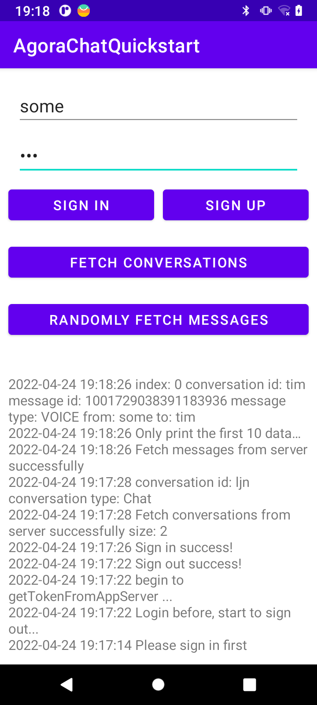

# 从 Agora Chat Server 获取会话列表及消息

本文详细介绍了如何从 Agora Chat Server 获取会话列表及消息。

## 登录 Agora Chat 系统流程
登录 Agora Chat 系统包括以下流程：
1. 客户端使用帐号和密码在 App Server 上注册。
2. 客户端注册成功后，使用账号和密码从  App Server 中获取 Token 。
3. 客户端使用账号和 Token 登录到 Chat 服务器。


## 前提条件
- 安装 Android 4.4+ 及以上版本操作系统的 Android 模拟器或真实设备。
- Android Studio 3.2或更高版本。
- Android SDK （版本取决于目标平台）。
- Java Development Kit （JDK），版本选择参考 Android 官方文档。
- 有效的 Agora Chat 开发者账号。
- [创建 Agora Chat 项目并获取 AppKey](https://docs-preprod.agora.io/en/test/enable_agora_chat)

## 建立项目

按照如下步骤配置使用 Agora Chat Android SDK 的项目环境。
### 1.创建 Android 项目

使用 Android Studio 创建一个 [Android 项目](https://developer.android.google.cn/studio/projects/create-project)。

- Project Template 选择 Empty Activity。
- Name 设为 AgoraChatQuickstart。
- Package name 设为 io.agora.agorachatquickstart。
- Language 选择 Java。

### 2.集成 Agora Chat SDK

将 Agora Chat SDK 集成到你的项目中。

在项目根目录的 build.gradle 文件中添加 MavenCentral 远程仓库。

```java
buildscript {
    repositories {
        ...
        mavenCentral()
    }
}
allprojects {
    repositories {
        ...
        mavenCentral()
    }
}
```
在项目的 /app/build.gradle 文件添加 io.agora.rtc:chat-sdk 依赖项（X.Y.Z 为当前版本号）。你可以在 [Sonatype](https://search.maven.org/) 官网查询最新版本号。

```java
android {
    
    compileOptions {
        sourceCompatibility JavaVersion.VERSION_1_8
        targetCompatibility JavaVersion.VERSION_1_8
    }
}
dependencies {
    ...
    implementation 'io.agora.rtc:chat-sdk:X.Y.Z'
}
```
### 3.防止代码混淆

在 app/proguard-rules.pro 文件中添加如下行，防止代码混淆：
```java
-keep class io.agora.** {*;}
-dontwarn  io.agora.**
```

### 4.添加权限

在 AndroidManifest.xml 中添加以下权限：
```xml
<uses-permission android:name="android.permission.INTERNET" />
<uses-permission android:name="android.permission.ACCESS_NETWORK_STATE"/>
<uses-permission android:name="android.permission.WAKE_LOCK"/>
```
>注意：
以上权限为保证项目运行的最基本要求，随着功能的增加，你需要根据项目情况增加必要的权限。
## 项目实现

这部分向你展示了如何通过 Agora Chat SDK 一步一步实现从 Agora Chat Server获取会话列表和漫游消息。
### 1.创建用户界面

为了帮助你快速实现并理解相关功能，本文通过最简方式，在一个 Activity 里实现以下操作：

- 登录和注册
- 从 Agora Chat Server 获取会话列表
- 从 Agora Chat Server 获取漫游消息

1. 打开 app/res/layout/activity_main.xml 并将文件内容替换为以下 XML 代码：
```xml
<?xml version="1.0" encoding="utf-8"?>
<LinearLayout xmlns:android="http://schemas.android.com/apk/res/android"
    xmlns:app="http://schemas.android.com/apk/res-auto"
    xmlns:tools="http://schemas.android.com/tools"
    android:layout_width="match_parent"
    android:layout_height="match_parent"
    android:orientation="vertical">

    <ScrollView
        android:layout_width="match_parent"
        android:layout_height="0dp"
        android:layout_weight="1">

        <androidx.constraintlayout.widget.ConstraintLayout
            android:layout_width="match_parent"
            android:layout_height="wrap_content">

            <EditText
                android:id="@+id/et_username"
                android:layout_width="0dp"
                android:layout_height="wrap_content"
                android:hint="@string/enter_username"
                app:layout_constraintLeft_toLeftOf="parent"
                app:layout_constraintRight_toRightOf="parent"
                app:layout_constraintTop_toTopOf="parent"
                android:layout_marginStart="20dp"
                android:layout_marginEnd="20dp"
                android:layout_marginTop="20dp"/>

            <EditText
                android:id="@+id/et_pwd"
                android:layout_width="0dp"
                android:layout_height="wrap_content"
                android:hint="@string/enter_password"
                android:inputType="textPassword"
                app:layout_constraintLeft_toLeftOf="parent"
                app:layout_constraintRight_toRightOf="parent"
                app:layout_constraintTop_toBottomOf="@id/et_username"
                android:layout_marginStart="20dp"
                android:layout_marginEnd="20dp"
                android:layout_marginTop="10dp"/>

            <Button
                android:id="@+id/btn_sign_in"
                android:layout_width="0dp"
                android:layout_height="wrap_content"
                android:text="@string/sign_in"
                app:layout_constraintStart_toStartOf="parent"
                app:layout_constraintTop_toBottomOf="@id/et_pwd"
                app:layout_constraintEnd_toStartOf="@id/btn_sign_up"
                android:layout_marginStart="10dp"
                android:layout_marginEnd="5dp"
                android:layout_marginTop="10dp"/>

            <Button
                android:id="@+id/btn_sign_up"
                android:layout_width="0dp"
                android:layout_height="wrap_content"
                android:text="@string/sign_up"
                android:onClick="signUp"
                app:layout_constraintStart_toEndOf="@id/btn_sign_in"
                app:layout_constraintEnd_toEndOf="parent"
                app:layout_constraintTop_toBottomOf="@id/et_pwd"
                app:layout_constraintTop_toTopOf="@id/btn_sign_in"
                android:layout_marginStart="5dp"
                android:layout_marginEnd="10dp"/>

            <Button
                android:id="@+id/btn_fetch_conversations"
                android:layout_width="0dp"
                android:layout_height="wrap_content"
                android:text="@string/fetch_conversations"
                app:layout_constraintLeft_toLeftOf="parent"
                app:layout_constraintRight_toRightOf="parent"
                app:layout_constraintTop_toBottomOf="@id/btn_sign_in"
                android:layout_marginStart="10dp"
                android:layout_marginEnd="10dp"
                android:layout_marginTop="20dp"/>

            <Button
                android:id="@+id/btn_fetch_messages"
                android:layout_width="0dp"
                android:layout_height="wrap_content"
                android:text="@string/fetch_messages"
                app:layout_constraintLeft_toLeftOf="parent"
                app:layout_constraintRight_toRightOf="parent"
                app:layout_constraintTop_toBottomOf="@id/btn_fetch_conversations"
                android:visibility="gone"
                android:layout_marginStart="10dp"
                android:layout_marginEnd="10dp"
                android:layout_marginTop="20dp"/>

        </androidx.constraintlayout.widget.ConstraintLayout>

    </ScrollView>

    <TextView
        android:id="@+id/tv_log"
        android:layout_width="match_parent"
        android:layout_height="0dp"
        android:layout_weight="1"
        android:minHeight="200dp"
        android:hint="@string/log_hint"
        android:scrollbars="vertical"
        android:padding="10dp"/>

</LinearLayout>
```
2. 打开 app/res/values/strings.xml 并将内容替换为以下 XML 代码：

```java
<resources>
    <string name="app_name">AgoraChatQuickstart</string>

    <string name="username_or_pwd_miss">Username or password is empty</string>
    <string name="sign_up_success">Sign up success!</string>
    <string name="sign_in_success">Sign in success!</string>
    <string name="sign_out_success">Sign out success!</string>
    <string name="enter_username">Enter username</string>
    <string name="enter_password">Enter password</string>
    <string name="sign_in">Sign in</string>
    <string name="sign_up">Sign up</string>
    <string name="enter_to_send_name">Enter the username you want to send</string>
    <string name="log_hint">Show log area...</string>
    <string name="sign_in_first">Please sign in first</string>
    <string name="not_find_send_name">Please enter the username who you want to send first!</string>

    <string name="show_conversation">conversation id: %1$s conversation type: %2$s</string>
    <string name="show_message">index: %1$d conversation id: %2$s message id: %3$s message type: %4$s from: %5$s to: %6$s</string>
    <string name="fetch_conversations">Fetch conversations</string>
    <string name="fetch_messages">Randomly fetch messages</string>
    <string name="fetch_conversations_success">Fetch conversations from server successfully</string>
    <string name="fetch_messages_success">Fetch messages from server successfully</string>
    <string name="fetch_conversation_failed">Fetch conversations from server failed! code: %1$d error: %2$s</string>
    <string name="fetch_message_failed">Fetch messages from server failed! code: %1$d error: %2$s</string>
    <string name="print_only_first_10_data">Only print the first 10 data…</string>

    <string name="app_key">Your App Key</string>
</resources>
```

你需要编辑以下字段：

- 将 "Your App Key" 替换为你的 [App Key](https://docs-preprod.agora.io/en/test/enable_agora_chat ) 。
- 在本示例中，你可以使用默认 App Key（41117440#383391）进行体验，正式开发环境需注册和使用你的 [App Key](https://docs.agora.io/cn/AgoraPlatform/sign_in_and_sign_up)。

**注意**

>如果你已经搭建了获取鉴权 Token 的 App Server，你需要将 Your App Key 替换为你的  App Key 。
### 2.将其他平台的消息转为 Agora Chat 消息并存储到本地数据库。

1. 打开 app/java/io.agora.agorachatquickstart/MainActivity.java 并将内容替换为以下 Java 代码：

```java
package io.agora.agorachatquickstart;

import android.annotation.SuppressLint;
import android.app.Activity;
import android.os.Bundle;
import android.text.method.ScrollingMovementMethod;
import android.view.View;
import android.widget.Button;
import android.widget.EditText;
import android.widget.TextView;

import androidx.annotation.Nullable;
import androidx.appcompat.app.AppCompatActivity;

import java.util.Iterator;
import java.util.List;
import java.util.Map;

import io.agora.ConnectionListener;
import io.agora.Error;
import io.agora.ValueCallBack;
import io.agora.agorachatquickstart.utils.AccountHelper;
import io.agora.agorachatquickstart.utils.LogUtils;

public class MainActivity extends AppCompatActivity implements ConnectionListener {
    private Activity mContext;
    private TextView tv_log;
    private Button btnSignIn;
    private Button btnSignUp;
    private EditText etUsername;
    private EditText etPwd;
    private Button btnFetchConversations;
    private Button btnFetchMessages;
    private Map<String, Conversation> mConversationMap;

    @Override
    protected void onCreate(@Nullable Bundle savedInstanceState) {
        super.onCreate(savedInstanceState);
        setContentView(R.layout.activity_main);
        mContext = this;
        AccountHelper.initSDK(this);
        initView();
        initListener();
    }

    private void initView() {
        tv_log = findViewById(R.id.tv_log);
        tv_log.setMovementMethod(new ScrollingMovementMethod());
        btnSignIn = findViewById(R.id.btn_sign_in);
        btnSignUp = findViewById(R.id.btn_sign_up);
        etUsername = findViewById(R.id.et_username);
        etPwd = findViewById(R.id.et_pwd);
        btnFetchConversations = findViewById(R.id.btn_fetch_conversations);
        btnFetchMessages = findViewById(R.id.btn_fetch_messages);
    }

    @SuppressLint("ClickableViewAccessibility")
    private void initListener() {
        // Register Agora Chat connect listener
        ChatClient.getInstance().addConnectionListener(this);
        btnSignIn.setOnClickListener(new View.OnClickListener() {
            @Override
            public void onClick(View v) {
                AccountHelper.signIn(mContext, tv_log,
                        etUsername.getText().toString().trim(), etPwd.getText().toString().trim());
            }
        });

        btnSignUp.setOnClickListener(new View.OnClickListener() {
            @Override
            public void onClick(View v) {
                AccountHelper.signUp(mContext, tv_log,
                        etUsername.getText().toString().trim(), etPwd.getText().toString().trim());
            }
        });
        btnFetchConversations.setOnClickListener(new View.OnClickListener() {
            @Override
            public void onClick(View v) {
                if(!ChatClient.getInstance().isLoggedIn()) {
                    LogUtils.showErrorToast(mContext, tv_log, getString(R.string.sign_in_first));
                    return;
                }
                fetchConversations();
            }
        });
        btnFetchMessages.setOnClickListener(new View.OnClickListener() {
            @Override
            public void onClick(View v) {
                fetchMessagesFromConversation();
            }
        });
    }

    /**
     * Fetch conversation list from Agora Chat Server
     */
    private void fetchConversations() {
        ChatClient.getInstance().chatManager().asyncFetchConversationsFromServer(new ValueCallBack<Map<String, Conversation>>() {
            @Override
            public void onSuccess(Map<String, Conversation> conversationMap) {
                LogUtils.showLog(tv_log, getString(R.string.fetch_conversations_success)+" size: "+conversationMap.size());
                if(conversationMap.size() > 0) {
                    runOnUiThread(()->btnFetchMessages.setVisibility(View.VISIBLE));
                    mConversationMap = conversationMap;
                    Iterator<Map.Entry<String, Conversation>> iterator = conversationMap.entrySet().iterator();
                    if(iterator.hasNext()) {
                        Map.Entry<String, Conversation> conversationEntry = iterator.next();
                        Conversation conv = conversationEntry.getValue();
                        LogUtils.showLog(tv_log, getString(R.string.show_conversation, conv.conversationId(), conv.getType().name()));
                    }
                }
            }

            @Override
            public void onError(int code, String error) {
                LogUtils.showErrorToast(mContext, tv_log, getString(R.string.fetch_conversation_failed, code, error));
            }
        });
    }

    /**
     * Fetch messages from Agora Chat Server by conversation id
     */
    private void fetchMessagesFromConversation() {
        int size = mConversationMap.size();
        int target = (int)(Math.random()*size);
        int index = 0;
        Conversation targetConversation = null;
        for (Conversation conversation : mConversationMap.values()) {
            if(target == index) {
                targetConversation = conversation;
                break;
            }
            index++;
        }
        if(targetConversation == null) {
            return;
        }
        ChatClient.getInstance().chatManager().asyncFetchHistoryMessage(targetConversation.conversationId(),
                targetConversation.getType(), 20, null, new ValueCallBack<CursorResult<ChatMessage>>() {
                    @Override
                    public void onSuccess(CursorResult<ChatMessage> result) {
                        LogUtils.showLog(tv_log, getString(R.string.fetch_messages_success));
                        LogUtils.showLog(tv_log, getString(R.string.print_only_first_10_data));
                        List<ChatMessage> messages = result.getData();
                        for(int i = 0; i < messages.size(); i++) {
                            if(i>=10) {
                                break;
                            }
                            ChatMessage message = messages.get(i);
                            LogUtils.showLog(tv_log, getString(R.string.show_message, i, message.conversationId(),
                                    message.getMsgId(), message.getType().name(), message.getFrom(), message.getTo()));
                        }
                    }

                    @Override
                    public void onError(int code, String error) {
                        LogUtils.showErrorToast(mContext, tv_log, getString(R.string.fetch_message_failed, code, error));
                    }
                });
    }

    @Override
    public void onConnected() {

    }

    @Override
    public void onDisconnected(int error) {
        if (error == Error.USER_REMOVED) {
            onUserException("account_removed");
        } else if (error == Error.USER_LOGIN_ANOTHER_DEVICE) {
            onUserException("account_conflict");
        } else if (error == Error.SERVER_SERVICE_RESTRICTED) {
            onUserException("account_forbidden");
        } else if (error == Error.USER_KICKED_BY_CHANGE_PASSWORD) {
            onUserException("account_kicked_by_change_password");
        } else if (error == Error.USER_KICKED_BY_OTHER_DEVICE) {
            onUserException("account_kicked_by_other_device");
        } else if(error == Error.USER_BIND_ANOTHER_DEVICE) {
            onUserException("user_bind_another_device");
        } else if(error == Error.USER_DEVICE_CHANGED) {
            onUserException("user_device_changed");
        } else if(error == Error.USER_LOGIN_TOO_MANY_DEVICES) {
            onUserException("user_login_too_many_devices");
        }
    }

    @Override
    public void onTokenExpired() {
        AccountHelper.signIn(this, tv_log,
                etUsername.getText().toString().trim(), etPwd.getText().toString().trim());
    }

    @Override
    public void onTokenWillExpire() {
        AccountHelper.getTokenFromServer(this, tv_log, etUsername.getText().toString().trim(),
                etPwd.getText().toString().trim(), AccountHelper.RENEW_TOKEN);
    }

    /**
     * user met some exception: conflict, removed or forbidden， goto login activity
     */
    protected void onUserException(String exception) {
        LogUtils.showErrorLog(tv_log, "onUserException: " + exception);
        AccountHelper.signOut(this, tv_log, null);
    }

    @Override
    protected void onDestroy() {
        super.onDestroy();
        // Unregister connect listener when activity is finishing
        ChatClient.getInstance().removeConnectionListener(this);
    }
}
```
2. 在 io.agora.agorachatquickstart 文件夹下新建文件夹 utils。
（1）在文件夹 utils 下新建类 AccountHelper，拷贝如下代码到 AccountHelper 中：
```java
package io.agora.agorachatquickstart.utils;

import static io.agora.cloud.HttpClientManager.Method_POST;

import android.app.Activity;
import android.content.Context;
import android.text.TextUtils;
import android.widget.TextView;
import android.widget.Toast;

import org.json.JSONObject;

import java.util.HashMap;
import java.util.Map;

import io.agora.CallBack;
import io.agora.chat.ChatClient;
import io.agora.chat.ChatOptions;
import io.agora.agorachatquickstart.R;
import io.agora.cloud.HttpClientManager;
import io.agora.cloud.HttpResponse;

public class AccountHelper {
    private static final String LOGIN_URL = "https://a41.easemob.com/app/chat/user/login";
    private static final String REGISTER_URL = "https://a41.easemob.com/app/chat/user/register";
    public static final String NEW_LOGIN = "NEW_LOGIN";
    public static final String RENEW_TOKEN = "RENEW_TOKEN";

    /**
     * Initialize Agora Chat SDK
     * @param context
     */
    public static void initSDK(Context context) {
        ChatOptions options = new ChatOptions();
        // Set your appkey applied from Agora Console
        String sdkAppkey = context.getString(R.string.app_key);
        if(TextUtils.isEmpty(sdkAppkey)) {
            Toast.makeText(context, "You should set your AppKey first!", Toast.LENGTH_SHORT).show();
            return;
        }
        // Set your appkey to options
        options.setAppKey(sdkAppkey);
        // Set you to use HTTPS only
        options.setUsingHttpsOnly(true);
        options.setAutoLogin(false);
        // To initialize Agora Chat SDK
        ChatClient.getInstance().init(context, options);
        // Make Agora Chat SDK debuggable
        ChatClient.getInstance().setDebugMode(true);
    }

    /**
     * Sign in
     * @param context
     * @param tv_log
     * @param username
     * @param pwd
     */
    public static void signIn(Activity context, TextView tv_log, String username, String pwd) {
        if(TextUtils.isEmpty(username) || TextUtils.isEmpty(pwd)) {
            LogUtils.showErrorToast(context, tv_log, context.getString(R.string.username_or_pwd_miss));
            return;
        }
        signOut(context, tv_log, new CallBack() {
            @Override
            public void onSuccess() {
                getTokenFromServer(context, tv_log, username, pwd, NEW_LOGIN);
            }

            @Override
            public void onError(int i, String s) {

            }

            @Override
            public void onProgress(int i, String s) {

            }
        });
    }

    /**
     * Get Agora Chat token, login in or renew token.
     * @param context
     * @param tv_log
     * @param username
     * @param pwd
     * @param requestType see {@link #RENEW_TOKEN} and {@link #NEW_LOGIN}
     */
    public static void getTokenFromServer(Activity context, TextView tv_log, String username, String pwd, String requestType) {
        new Thread(new Runnable() {
            @Override
            public void run() {
                try {
                    Map<String, String> headers = new HashMap<>();
                    headers.put("Content-Type", "application/json");

                    JSONObject request = new JSONObject();
                    request.putOpt("userAccount", username);
                    request.putOpt("userPassword", pwd);

                    LogUtils.showErrorLog(tv_log,"begin to getTokenFromAppServer ...");

                    HttpResponse response = HttpClientManager.httpExecute(LOGIN_URL, headers, request.toString(), Method_POST);
                    int code = response.code;
                    String responseInfo = response.content;
                    if (code == 200) {
                        if (responseInfo != null && responseInfo.length() > 0) {
                            JSONObject object = new JSONObject(responseInfo);
                            String token = object.getString("accessToken");
                            if(TextUtils.equals(requestType, NEW_LOGIN)) {
                                ChatClient.getInstance().loginWithAgoraToken(username, token, new CallBack() {
                                    @Override
                                    public void onSuccess() {
                                        LogUtils.showToast(context, tv_log, context.getString(R.string.sign_in_success));
                                    }

                                    @Override
                                    public void onError(int code, String error) {
                                        LogUtils.showErrorToast(context, tv_log, "Login failed! code: " + code + " error: " + error);
                                    }

                                    @Override
                                    public void onProgress(int progress, String status) {

                                    }
                                });
                            }else if(TextUtils.equals(requestType, RENEW_TOKEN)) {
                                ChatClient.getInstance().renewToken(token);
                            }

                        } else {
                            LogUtils.showErrorToast(context, tv_log, "getTokenFromAppServer failed! code: " + code + " error: " + responseInfo);
                        }
                    } else {
                        LogUtils.showErrorToast(context, tv_log, "getTokenFromAppServer failed! code: " + code + " error: " + responseInfo);
                    }
                } catch (Exception e) {
                    e.printStackTrace();
                    LogUtils.showErrorToast(context, tv_log, "getTokenFromAppServer failed! code: " + 0 + " error: " + e.getMessage());

                }
            }
        }).start();
    }

    /**
     * Sign up
     * @param context
     * @param tv_log
     * @param username
     * @param pwd
     */
    public static void signUp(Activity context, TextView tv_log, String username, String pwd) {
        if(TextUtils.isEmpty(username) || TextUtils.isEmpty(pwd)) {
            LogUtils.showErrorToast(context, tv_log, context.getString(R.string.username_or_pwd_miss));
            return;
        }
        new Thread(new Runnable() {
            @Override
            public void run() {
                try {
                    Map<String, String> headers = new HashMap<>();
                    headers.put("Content-Type", "application/json");
                    JSONObject request = new JSONObject();
                    request.putOpt("userAccount", username);
                    request.putOpt("userPassword", pwd);

                    LogUtils.showErrorLog(tv_log,"begin to signUp...");

                    HttpResponse response = HttpClientManager.httpExecute(REGISTER_URL, headers, request.toString(), Method_POST);
                    int code=  response.code;
                    String responseInfo = response.content;
                    if (code == 200) {
                        if (responseInfo != null && responseInfo.length() > 0) {
                            JSONObject object = new JSONObject(responseInfo);
                            String resultCode = object.getString("code");
                            if(resultCode.equals("RES_OK")) {
                                LogUtils.showToast(context, tv_log, context.getString(R.string.sign_up_success));
                            }else{
                                String errorInfo = object.getString("errorInfo");
                                LogUtils.showErrorLog(tv_log,errorInfo);
                            }
                        } else {
                            LogUtils.showErrorLog(tv_log,responseInfo);
                        }
                    } else {
                        LogUtils.showErrorLog(tv_log,responseInfo);
                    }
                } catch (Exception e) {
                    e.printStackTrace();
                    LogUtils.showErrorLog(tv_log, e.getMessage());
                }
            }
        }).start();
    }

    /**
     * Sign out
     * @param context
     * @param tv_log
     * @param callBack
     */
    public static void signOut(Activity context, TextView tv_log, CallBack callBack) {
        if(ChatClient.getInstance().isLoggedInBefore()) {
            LogUtils.showLog(tv_log, "Login before, start to sign out...");
            ChatClient.getInstance().logout(true, new CallBack() {
                @Override
                public void onSuccess() {
                    LogUtils.showToast(context, tv_log, context.getString(R.string.sign_out_success));
                    if(callBack != null) {
                        callBack.onSuccess();
                    }
                }

                @Override
                public void onError(int code, String error) {
                    LogUtils.showErrorToast(context, tv_log, "Sign out failed! code: "+code + " error: "+error);
                    if(callBack != null) {
                        callBack.onError(code, error);
                    }
                }

                @Override
                public void onProgress(int progress, String status) {

                }
            });
        }else {
            if(callBack != null) {
                callBack.onSuccess();
            }
        }
    }
}
```
（2）在文件夹 utils 下新建类 LogUtils，拷贝如下代码到 LogUtils 中：
```java
package io.agora.agorachatquickstart.utils;

import android.app.Activity;
import android.os.Handler;
import android.os.Looper;
import android.text.TextUtils;
import android.util.Log;
import android.widget.TextView;
import android.widget.Toast;

import java.text.SimpleDateFormat;
import java.util.Calendar;
import java.util.Date;
import java.util.Locale;
import java.util.TimeZone;

public class LogUtils {
    private static final String TAG = LogUtils.class.getSimpleName();

    public static void showErrorLog(TextView tvLog, String content) {
        showLog(tvLog, content);
    }

    public static void showNormalLog(TextView tvLog, String content) {
        showLog(tvLog, content);
    }

    public static void showLog(TextView tvLog, String content) {
        if(TextUtils.isEmpty(content) || tvLog == null) {
            return;
        }
        tvLog.post(()-> {
            String preContent = tvLog.getText().toString().trim();
            StringBuilder builder = new StringBuilder();
            builder.append(formatCurrentTime())
                    .append(" ")
                    .append(content)
                    .append("\n")
                    .append(preContent);
            tvLog.setText(builder);
        });
    }

    public static void showErrorToast(Activity activity, TextView tvLog, String content) {
        if(activity == null || activity.isFinishing()) {
            Log.e(TAG, "Context is null...");
            return;
        }
        if(TextUtils.isEmpty(content)) {
            return;
        }
        activity.runOnUiThread(()-> {
            Toast.makeText(activity, content, Toast.LENGTH_SHORT).show();
            showErrorLog(tvLog,content);
        });
    }

    public static void showToast(Activity activity, TextView tvLog, String content) {
        if(TextUtils.isEmpty(content) || activity == null || activity.isFinishing()) {
            return;
        }
        activity.runOnUiThread(()-> {
            Toast.makeText(activity, content, Toast.LENGTH_SHORT).show();
            showNormalLog(tvLog, content);
        });
    }

    private static String formatCurrentTime() {
        SimpleDateFormat sdf = new SimpleDateFormat("yyyy-MM-dd HH:mm:ss", Locale.getDefault());
        return sdf.format(new Date());
    }

}
```

### 3.编译并运行项目

使用 Android Studio 在模拟器或真机上编译并运行项目。运行成功之后，你可以进行以下操作：

- 登录和注册
- 从 Agora Chat Server 获取会话列表
- 从 Agora Chat Server 获取漫游消息

运行效果如下图所示：



## 相关信息

### 1.集成 Agora Chat SDK
选择以下任意一种方式将 Agora Chat SDK 集成到你的项目中。本文使用方法 1 进行集成。

**方法 1：使用 MavenCentral 自动集成**

在项目根目录的 build.gradle 文件中添加 MavenCentral 远程仓库。

```java
buildscript {
    repositories {
        ...
        mavenCentral()
    }
}
allprojects {
    repositories {
        ...
        mavenCentral()
    }
}
```
在项目的 /app/build.gradle 文件添加 io.agora.rtc:chat-sdk 依赖项（X.Y.Z 为当前版本号）。你可以在 [Sonatype](https://search.maven.org/) 官网查询最新版本号。

```java
android {
    defaultConfig {
            // 支持SDK版本为19以上
            minSdkVersion 19
    }
    compileOptions {
        sourceCompatibility JavaVersion.VERSION_1_8
        targetCompatibility JavaVersion.VERSION_1_8
    }
}
dependencies {
    ...
    implementation 'io.agora.rtc:chat-sdk:X.Y.Z'
}
```

**方法 2：手动下载 SDK 包**

1. 下载最新版的 [Agora Chat SDK for Android]([https://download.agora.io/sdk/release/Agora_Chat_SDK_for_Android_v1.0.1.zip](https://download.agora.io/sdk/release/Agora_Chat_SDK_for_Android_v1.0.0.zip)) 并解压。
2. 将 SDK 包内 libs 路径下的以下文件，拷贝到你的项目路径下：

| 文件                                           | 对应项目文件                                     |
|:-----------------------------------------------|:----------------------------------------------|
| agorachat_X.Y.Z.jar                            | ~/app/libs/                                   |
| /arm64-v8a/libagora-chat-sdk.so及libsqlite.so  | ~/app/src/main/jniLibs/arm64-v8a/             |
| /armeabi-v7a/libagora-chat-sdk.so及libsqlite.so | ~/app/src/main/jniLibs/armeabi-v7a/          |
| /x86/libagora-chat-sdk.so及libsqlite.so        | ~/app/src/main/jniLibs/x86/                   |
| /x86_64/libagora-chat-sdk.so及libsqlite.so     | ~/app/src/main/jniLibs/x86_64/                 |

>注：表格中 agorachat_X.Y.Z.jar 的 X.Y.Z 代指 SDK jar 包的版本号，以你下载的为准。

### 2.搭建自己获取 Token 的 App Server。
1. 在实际开发中，用户需要搭建自己的 App Server 去获取鉴权的 Token。
2. 在用户的 App Server 中需要配置用户申请的 AppKey。