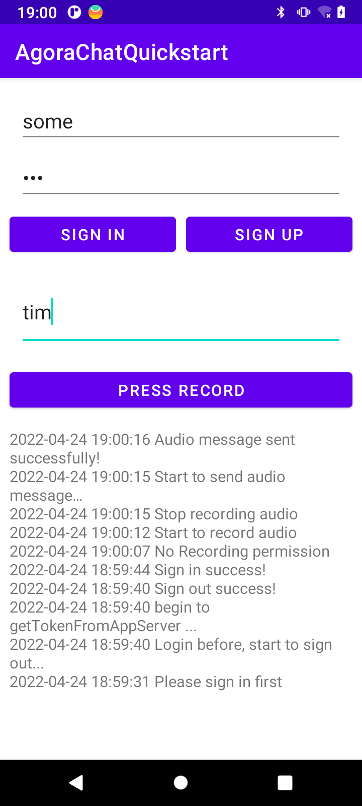

# 录制并发送语音消息

本文详细介绍了如何录制音频文件并发送 Agora Chat 语音消息。

## 消息发送与接收流程
登录 Agora Chat 系统包括以下流程：
1. 客户端使用帐号和密码在 App Server 上注册。
2. 客户端注册成功后，使用账号和密码从  App Server 中获取 Token 。
3. 客户端使用账号和 Token 登录到 Chat 服务器。


发送和接收点对点消息包括以下流程：

1. 客户端 A 发送点对点消息到 Chat 服务器。
2. Chat 服务器将消息发送到客户端 B。客户端 B 收到点对点消息。

## 前提条件
- 安装 Android 4.4+ 及以上版本操作系统的 Android 模拟器或真实设备。
- Android Studio 3.2或更高版本。
- Android SDK （版本取决于目标平台）。
- Java Development Kit （JDK），版本选择参考 Android 官方文档。
- 有效的 Agora Chat 开发者账号。
- [创建 Agora Chat 项目并获取 AppKey](https://docs-preprod.agora.io/en/test/enable_agora_chat)

## 建立项目

按照如下步骤配置使用 Agora Chat Android SDK 的项目环境。
### 1.创建 Android 项目

使用 Android Studio 创建一个 [Android 项目](https://developer.android.google.cn/studio/projects/create-project)。

- Project Template 选择 Empty Activity。
- Name 设为 AgoraChatQuickstart。
- Package name 设为 io.agora.agorachatquickstart。
- Language 选择 Java。

### 2.集成 Agora Chat SDK

将 Agora Chat SDK 集成到你的项目中。

在项目根目录的 build.gradle 文件中添加 MavenCentral 远程仓库。

```java
buildscript {
    repositories {
        ...
        mavenCentral()
    }
}
allprojects {
    repositories {
        ...
        mavenCentral()
    }
}
```
在项目的 /app/build.gradle 文件添加 io.agora.rtc:chat-sdk 依赖项（X.Y.Z 为当前版本号）。你可以在 [Sonatype](https://search.maven.org/) 官网查询最新版本号。

```java
android {
    
    compileOptions {
        sourceCompatibility JavaVersion.VERSION_1_8
        targetCompatibility JavaVersion.VERSION_1_8
    }
}
dependencies {
    ...
    implementation 'io.agora.rtc:chat-sdk:X.Y.Z'
}
```
### 3.防止代码混淆

在 app/proguard-rules.pro 文件中添加如下行，防止代码混淆：
```java
-keep class io.agora.** {*;}
-dontwarn  io.agora.**
```

### 4.添加权限

在 AndroidManifest.xml 中添加以下权限：
```xml
<uses-permission android:name="android.permission.INTERNET" />
<uses-permission android:name="android.permission.ACCESS_NETWORK_STATE"/>
<uses-permission android:name="android.permission.WAKE_LOCK"/>
<uses-permission android:name="android.permission.WRITE_EXTERNAL_STORAGE"/>
<uses-permission android:name="android.permission.RECORD_AUDIO"/>
```
>注意：
以上权限为保证项目运行的最基本要求，随着功能的增加，你需要根据项目情况增加必要的权限。
## 项目实现

这部分向你展示了如何通过 Agora Chat SDK 一步一步实现语音消息发送的。
### 1.创建用户界面

为了帮助你快速实现并理解相关功能，本文通过最简方式，在一个 Activity 里实现以下操作：

- 登录和注册
- 录制语音文件并发送 Agora Chat 语音消息。

1. 打开 app/res/layout/activity_main.xml 并将文件内容替换为以下 XML 代码：
```xml
<?xml version="1.0" encoding="utf-8"?>
<LinearLayout xmlns:android="http://schemas.android.com/apk/res/android"
    xmlns:app="http://schemas.android.com/apk/res-auto"
    xmlns:tools="http://schemas.android.com/tools"
    android:layout_width="match_parent"
    android:layout_height="match_parent"
    android:orientation="vertical">

    <ScrollView
        android:layout_width="match_parent"
        android:layout_height="0dp"
        android:layout_weight="1">

        <androidx.constraintlayout.widget.ConstraintLayout
            android:layout_width="match_parent"
            android:layout_height="wrap_content">

            <EditText
                android:id="@+id/et_username"
                android:layout_width="0dp"
                android:layout_height="wrap_content"
                android:hint="@string/enter_username"
                app:layout_constraintLeft_toLeftOf="parent"
                app:layout_constraintRight_toRightOf="parent"
                app:layout_constraintTop_toTopOf="parent"
                android:layout_marginStart="20dp"
                android:layout_marginEnd="20dp"
                android:layout_marginTop="20dp"/>

            <EditText
                android:id="@+id/et_pwd"
                android:layout_width="0dp"
                android:layout_height="wrap_content"
                android:hint="@string/enter_password"
                android:inputType="textPassword"
                app:layout_constraintLeft_toLeftOf="parent"
                app:layout_constraintRight_toRightOf="parent"
                app:layout_constraintTop_toBottomOf="@id/et_username"
                android:layout_marginStart="20dp"
                android:layout_marginEnd="20dp"
                android:layout_marginTop="10dp"/>

            <Button
                android:id="@+id/btn_sign_in"
                android:layout_width="0dp"
                android:layout_height="wrap_content"
                android:text="@string/sign_in"
                app:layout_constraintStart_toStartOf="parent"
                app:layout_constraintTop_toBottomOf="@id/et_pwd"
                app:layout_constraintEnd_toStartOf="@id/btn_sign_up"
                android:layout_marginStart="10dp"
                android:layout_marginEnd="5dp"
                android:layout_marginTop="10dp"/>

            <Button
                android:id="@+id/btn_sign_up"
                android:layout_width="0dp"
                android:layout_height="wrap_content"
                android:text="@string/sign_up"
                android:onClick="signUp"
                app:layout_constraintStart_toEndOf="@id/btn_sign_in"
                app:layout_constraintEnd_toEndOf="parent"
                app:layout_constraintTop_toBottomOf="@id/et_pwd"
                app:layout_constraintTop_toTopOf="@id/btn_sign_in"
                android:layout_marginStart="5dp"
                android:layout_marginEnd="10dp"/>

            <EditText
                android:id="@+id/et_to_chat_name"
                android:layout_width="0dp"
                android:layout_height="wrap_content"
                android:hint="@string/enter_to_send_name"
                app:layout_constraintLeft_toLeftOf="parent"
                app:layout_constraintRight_toRightOf="parent"
                app:layout_constraintTop_toBottomOf="@id/btn_sign_in"
                android:layout_marginStart="20dp"
                android:layout_marginEnd="20dp"
                android:layout_marginTop="20dp"/>

            <Button
                android:id="@+id/btn_start_recording"
                android:layout_width="0dp"
                android:layout_height="wrap_content"
                android:text="@string/start_recording"
                app:layout_constraintLeft_toLeftOf="parent"
                app:layout_constraintRight_toRightOf="parent"
                app:layout_constraintTop_toBottomOf="@id/et_to_chat_name"
                android:layout_marginStart="10dp"
                android:layout_marginEnd="10dp"
                android:layout_marginTop="20dp"/>

        </androidx.constraintlayout.widget.ConstraintLayout>

    </ScrollView>

    <TextView
        android:id="@+id/tv_log"
        android:layout_width="match_parent"
        android:layout_height="0dp"
        android:layout_weight="1"
        android:minHeight="200dp"
        android:hint="@string/log_hint"
        android:scrollbars="vertical"
        android:padding="10dp"/>

</LinearLayout>
```
2. 打开 app/res/values/strings.xml 并将内容替换为以下 XML 代码：

```java
<resources>
    <string name="app_name">AgoraChatQuickstart</string>

    <string name="username_or_pwd_miss">Username or password is empty</string>
    <string name="sign_up_success">Sign up success!</string>
    <string name="sign_in_success">Sign in success!</string>
    <string name="sign_out_success">Sign out success!</string>
    <string name="enter_username">Enter username</string>
    <string name="enter_password">Enter password</string>
    <string name="sign_in">Sign in</string>
    <string name="sign_up">Sign up</string>
    <string name="enter_to_send_name">Enter the username you want to send</string>
    <string name="log_hint">Show log area...</string>
    <string name="sign_in_first">Please sign in first</string>
    <string name="not_find_send_name">Please enter the username who you want to send first!</string>
    <string name="message_sent_failed">Message sent failed! code: %1$d error: %2$s</string>

    <string name="send_audio_message">Send audio message</string>
    <string name="start_recording">Press record</string>
    <string name="recording_without_permission">No Recording permission</string>
    <string name="recording_time_is_too_short">Speech too short</string>
    <string name="send_failure_please">Failed to send message, please check the server connection.</string>
    <string name="send_voice_need_sdcard_support">You need an SD card to send voice messages</string>
    <string name="recoding_fail">Recording failed, please try again!</string>
    <string name="send_audio_message_success">Audio message sent successfully!</string>
    <string name="not_find_send_audio_name">Please enter the username who you want to send first!</string>
    <string name="start_record">Start to record audio</string>
    <string name="stop_record">Stop recording audio</string>
    <string name="start_to_send_audio">Start to send audio message…</string>

    <string name="app_key">Your App Key</string>
</resources>
```

你需要编辑以下字段：

- 将 "Your App Key" 替换为你的 [App Key](https://docs-preprod.agora.io/en/test/enable_agora_chat ) 。
- 在本示例中，你可以使用默认 App Key（41117440#383391）进行体验，正式开发环境需注册和使用你的 [App Key](https://docs.agora.io/cn/AgoraPlatform/sign_in_and_sign_up)。

**注意**

>如果你已经搭建了获取鉴权 Token 的 App Server，你需要将 Your App Key 替换为你的  App Key 。
### 2.将其他平台的消息转为 Agora Chat 消息并存储到本地数据库。

1. 打开 app/java/io.agora.agorachatquickstart/MainActivity.java 并将内容替换为以下 Java 代码：

```java
package io.agora.agorachatquickstart;

import android.Manifest;
import android.annotation.SuppressLint;
import android.app.Activity;
import android.content.Context;
import android.net.Uri;
import android.os.Bundle;
import android.os.PowerManager;
import android.text.TextUtils;
import android.text.method.ScrollingMovementMethod;
import android.util.TypedValue;
import android.view.MotionEvent;
import android.view.View;
import android.widget.Button;
import android.widget.EditText;
import android.widget.TextView;

import androidx.annotation.Nullable;
import androidx.appcompat.app.AppCompatActivity;

import io.agora.CallBack;
import io.agora.ConnectionListener;
import io.agora.Error;
import io.agora.agorachatquickstart.record.EaseChatRowVoicePlayer;
import io.agora.agorachatquickstart.record.EaseVoiceRecorder;
import io.agora.agorachatquickstart.utils.AccountHelper;
import io.agora.agorachatquickstart.utils.LogUtils;
import io.agora.agorachatquickstart.utils.PermissionsManager;
import io.agora.util.EMLog;

public class MainActivity extends AppCompatActivity implements ConnectionListener {
    private Activity mContext;
    private Button btnStartRecording;
    private TextView tv_log;
    private EditText etToChatName;
    private EaseVoiceRecorder voiceRecorder;
    private PowerManager.WakeLock wakeLock;
    private String toChatUsername;
    private Button btnSignIn;
    private EditText etUsername;
    private EditText etPwd;
    private Button btnSignUp;

    private boolean canRecord = false;

    @Override
    protected void onCreate(@Nullable Bundle savedInstanceState) {
        super.onCreate(savedInstanceState);
        setContentView(R.layout.activity_main);
        mContext = this;
        AccountHelper.initSDK(this);
        initView();
        initListener();
        initData();
    }

    private void initView() {
        btnStartRecording = findViewById(R.id.btn_start_recording);
        tv_log = findViewById(R.id.tv_log);
        tv_log.setMovementMethod(new ScrollingMovementMethod());
        etToChatName = findViewById(R.id.et_to_chat_name);
        btnSignIn = findViewById(R.id.btn_sign_in);
        btnSignUp = findViewById(R.id.btn_sign_up);
        etUsername = findViewById(R.id.et_username);
        etPwd = findViewById(R.id.et_pwd);
    }

    @SuppressLint("ClickableViewAccessibility")
    private void initListener() {
        btnSignIn.setOnClickListener(new View.OnClickListener() {
            @Override
            public void onClick(View v) {
                AccountHelper.signIn(mContext, tv_log,
                        etUsername.getText().toString().trim(), etPwd.getText().toString().trim());
            }
        });

        btnSignUp.setOnClickListener(new View.OnClickListener() {
            @Override
            public void onClick(View v) {
                AccountHelper.signUp(mContext, tv_log,
                        etUsername.getText().toString().trim(), etPwd.getText().toString().trim());
            }
        });

        btnStartRecording.setOnLongClickListener(new View.OnLongClickListener() {
            @Override
            public boolean onLongClick(View v) {
                return false;
            }
        });
        btnStartRecording.setOnTouchListener((v, event) -> {
            switch (event.getAction()) {
                case MotionEvent.ACTION_DOWN:
                    if(!ChatClient.getInstance().isLoggedIn()) {
                        LogUtils.showErrorToast(mContext, tv_log, getString(R.string.sign_in_first));
                        return false;
                    }
                    if (!checkRecordPermission()) {
                        LogUtils.showErrorLog(tv_log, getString(R.string.recording_without_permission));
                        return false;
                    }
                    toChatUsername = etToChatName.getText().toString().trim();
                    if(TextUtils.isEmpty(toChatUsername)) {
                        LogUtils.showErrorLog(tv_log, getString(R.string.not_find_send_audio_name));
                        return false;
                    }
                    canRecord = true;
                    startRecord();
                    return true;
                case MotionEvent.ACTION_MOVE:
                    if(!canRecord) {
                        return false;
                    }
                    moveAction(event);
                    return true;
                case MotionEvent.ACTION_UP:
                    if(!canRecord) {
                        return false;
                    }
                    stopRecord(event);
                    canRecord = false;
                    return true;
                default:
                    return false;
            }
        });
        // Register Agora Chat connect listener
        ChatClient.getInstance().addConnectionListener(this);
    }

    /**
     * Check record audio permission
     * @return
     */
    private boolean checkRecordPermission() {
        // Check if have the permission of RECORD_AUDIO
        if (!PermissionsManager.getInstance().hasPermission(this, Manifest.permission.RECORD_AUDIO)) {
            PermissionsManager.getInstance().requestPermissions(this, new String[]{Manifest.permission.RECORD_AUDIO}, 100);
            return false;
        }
        return true;
    }

    @SuppressLint("InvalidWakeLockTag")
    private void initData() {
        voiceRecorder = new EaseVoiceRecorder(null);
        wakeLock = ((PowerManager) this.getSystemService(Context.POWER_SERVICE)).newWakeLock(
                PowerManager.SCREEN_DIM_WAKE_LOCK, "sendAudio");

    }

    /**
     * Send audio message
     * @param length
     */
    private void sendAudioMessage(int length) {
        LogUtils.showLog(tv_log, getString(R.string.start_to_send_audio));
        String voiceFilePath = voiceRecorder.getVoiceFilePath();
        ChatMessage message = ChatMessage.createVoiceSendMessage(Uri.parse(voiceFilePath), length, toChatUsername);
        message.setMessageStatusCallback(new CallBack() {
            @Override
            public void onSuccess() {
                LogUtils.showLog(tv_log, getString(R.string.send_audio_message_success));
            }

            @Override
            public void onError(int code, String error) {
                LogUtils.showErrorToast(mContext, tv_log,
                        getString(R.string.message_sent_failed, code, error));
            }

            @Override
            public void onProgress(int progress, String status) {

            }
        });
        // send message
        ChatClient.getInstance().chatManager().sendMessage(message);
    }

    /**
     * Start to record
     */
    private void startRecord() {
        try {
            EaseChatRowVoicePlayer voicePlayer = EaseChatRowVoicePlayer.getInstance(this);
            if (voicePlayer.isPlaying())
                voicePlayer.stop();
            startRecording();
        } catch (Exception e) {

        }
    }

    /**
     * Move action, do nothing
     * @param event
     */
    private void moveAction(MotionEvent event) {
        if (event.getY() < dip2px(this, 10)) {
            //showReleaseToCancelHint();
        } else {
            //showMoveUpToCancelHint();
        }
    }

    /**
     * Stop recording
     * @param event
     */
    private void stopRecord(MotionEvent event) {
        if (event.getY() < 0) {
            // discard the recorded audio.
            discardRecording();
        } else {
            // stop recording and send voice file
            try {
                int length = stopRecoding();
                if (length > 0) {
                    sendAudioMessage(length);
                } else if (length == Error.FILE_INVALID) {
                    LogUtils.showErrorToast(this, tv_log, getString(R.string.recording_without_permission));
                } else {
                    LogUtils.showErrorToast(this, tv_log, getString(R.string.recording_time_is_too_short));
                }
            } catch (Exception e) {
                e.printStackTrace();
                LogUtils.showErrorToast(this, tv_log, getString(R.string.send_failure_please));
            }
        }
    }

    /**
     * Start to record
     */
    private void startRecording() {
        if (!android.os.Environment.getExternalStorageState().equals(android.os.Environment.MEDIA_MOUNTED)) {
            LogUtils.showErrorToast(this, tv_log, getString(R.string.send_voice_need_sdcard_support));
            return;
        }
        LogUtils.showLog(tv_log, getString(R.string.start_record));
        try {
            wakeLock.acquire();
            voiceRecorder.startRecording(this);
        } catch (Exception e) {
            e.printStackTrace();
            if (wakeLock.isHeld())
                wakeLock.release();
            if (voiceRecorder != null)
                voiceRecorder.discardRecording();
            LogUtils.showErrorToast(this, tv_log, getString(R.string.recoding_fail));
            return;
        }
    }

    /**
     * Stop recording
     * @return
     */
    private int stopRecoding() {
        if (wakeLock.isHeld())
            wakeLock.release();
        LogUtils.showLog(tv_log, getString(R.string.stop_record));
        return voiceRecorder.stopRecoding();
    }

    /**
     * Discard recording
     */
    private void discardRecording() {
        if (wakeLock.isHeld())
            wakeLock.release();
        try {
            // stop recording
            if (voiceRecorder.isRecording()) {
                voiceRecorder.discardRecording();
            }
        } catch (Exception e) {
        }
    }

    @Override
    public void onConnected() {

    }

    @Override
    public void onDisconnected(int error) {
        if (error == Error.USER_REMOVED) {
            onUserException("account_removed");
        } else if (error == Error.USER_LOGIN_ANOTHER_DEVICE) {
            onUserException("account_conflict");
        } else if (error == Error.SERVER_SERVICE_RESTRICTED) {
            onUserException("account_forbidden");
        } else if (error == Error.USER_KICKED_BY_CHANGE_PASSWORD) {
            onUserException("account_kicked_by_change_password");
        } else if (error == Error.USER_KICKED_BY_OTHER_DEVICE) {
            onUserException("account_kicked_by_other_device");
        } else if(error == Error.USER_BIND_ANOTHER_DEVICE) {
            onUserException("user_bind_another_device");
        } else if(error == Error.USER_DEVICE_CHANGED) {
            onUserException("user_device_changed");
        } else if(error == Error.USER_LOGIN_TOO_MANY_DEVICES) {
            onUserException("user_login_too_many_devices");
        }
    }

    @Override
    public void onTokenExpired() {
        AccountHelper.signIn(this, tv_log,
                etUsername.getText().toString().trim(), etPwd.getText().toString().trim());
    }

    @Override
    public void onTokenWillExpire() {
        AccountHelper.getTokenFromServer(this, tv_log, etUsername.getText().toString().trim(),
                etPwd.getText().toString().trim(), AccountHelper.RENEW_TOKEN);
    }

    /**
     * user met some exception: conflict, removed or forbidden， goto login activity
     */
    protected void onUserException(String exception) {
        LogUtils.showErrorLog(tv_log, "onUserException: " + exception);
        AccountHelper.signOut(this, tv_log, null);
    }

    @Override
    protected void onDestroy() {
        super.onDestroy();
        // Unregister connect listener when activity is finishing
        ChatClient.getInstance().removeConnectionListener(this);
    }

    /**
     * dip to px
     *
     * @param context
     * @param value
     * @return
     */
    public static float dip2px(Context context, float value) {
        return TypedValue.applyDimension(TypedValue.COMPLEX_UNIT_DIP, value, context.getResources().getDisplayMetrics());
    }
}
```
2. 在 io.agora.agorachatquickstart 文件夹下新建文件夹 record。
（1）在文件夹 record 下新建类 EaseChatRowVoicePlayer，拷贝如下代码到 EaseChatRowVoicePlayer 中：
```java
package io.agora.agorachatquickstart.record;

import android.content.Context;
import android.media.AudioManager;
import android.media.MediaPlayer;

import java.io.IOException;

import io.agora.chat.ChatMessage;
import io.agora.chat.VoiceMessageBody;


public class EaseChatRowVoicePlayer {
    private static final String TAG = EaseChatRowVoicePlayer.class.getSimpleName();

    private static EaseChatRowVoicePlayer instance = null;

    private AudioManager audioManager;
    private MediaPlayer mediaPlayer;
    private String playingId;

    private MediaPlayer.OnCompletionListener onCompletionListener;
    private final Context baseContext;

    public static EaseChatRowVoicePlayer getInstance(Context context) {
        if (instance == null) {
            synchronized (EaseChatRowVoicePlayer.class) {
                if (instance == null) {
                    instance = new EaseChatRowVoicePlayer(context);
                }
            }
        }
        return instance;
    }

    public MediaPlayer getPlayer() {
        return mediaPlayer;
    }

    public boolean isPlaying() {
        return mediaPlayer.isPlaying();
    }

    /**
     * May null, please consider.
     *
     * @return
     */
    public String getCurrentPlayingId() {
        return playingId;
    }

    public void play(final ChatMessage msg, final MediaPlayer.OnCompletionListener listener) {
        if (!(msg.getBody() instanceof VoiceMessageBody)) return;

        if (mediaPlayer.isPlaying()) {
            stop();
        }

        playingId = msg.getMsgId();
        onCompletionListener = listener;

        try {
            setSpeaker();
            VoiceMessageBody voiceBody = (VoiceMessageBody) msg.getBody();
            mediaPlayer.setDataSource(baseContext, voiceBody.getLocalUri());
            mediaPlayer.prepare();
            mediaPlayer.setOnCompletionListener(new MediaPlayer.OnCompletionListener() {
                @Override
                public void onCompletion(MediaPlayer mp) {
                    stop();

                    playingId = null;
                    onCompletionListener = null;
                }
            });
            mediaPlayer.start();
        } catch (IOException e) {
            e.printStackTrace();
        }
    }

    public void stop() {
        mediaPlayer.stop();
        mediaPlayer.reset();

        /**
         * This listener is to stop the voice play animation currently, considered the following 3 conditions:
         *
         * 1.A new voice item is clicked to play, to stop the previous playing voice item animation.
         * 2.The voice is play complete, to stop it's voice play animation.
         * 3.Press the voice record button will stop the voice play and must stop voice play animation.
         *
         */
        if (onCompletionListener != null) {
            onCompletionListener.onCompletion(mediaPlayer);
        }
    }

    public void release() {
        onCompletionListener = null;
    }

    private EaseChatRowVoicePlayer(Context cxt) {
        baseContext = cxt.getApplicationContext();
        audioManager = (AudioManager) baseContext.getSystemService(Context.AUDIO_SERVICE);
        mediaPlayer = new MediaPlayer();
    }

    private void setSpeaker() {
        audioManager.setMode(AudioManager.MODE_NORMAL);
        audioManager.setSpeakerphoneOn(true);
        mediaPlayer.setAudioStreamType(AudioManager.STREAM_RING);
    }
}
```
（2）在文件夹 record 下新建类 EaseVoiceRecorder，拷贝如下代码到 EaseVoiceRecorder 中：
```java
package io.agora.agorachatquickstart.record;

import android.content.Context;
import android.media.MediaRecorder;
import android.os.Handler;
import android.os.Message;
import android.os.SystemClock;
import android.text.format.Time;

import java.io.File;
import java.io.IOException;
import java.util.Date;

import io.agora.Error;
import io.agora.chat.ChatClient;
import io.agora.util.EMLog;
import io.agora.util.PathUtil;

public class EaseVoiceRecorder {
    MediaRecorder recorder;

    static final String PREFIX = "voice";
    static final String EXTENSION = ".amr";

    private boolean isRecording = false;
    private long startTime;
    private String voiceFilePath = null;
    private String voiceFileName = null;
    private File file;
    private Handler handler;

    public EaseVoiceRecorder(Handler handler) {
        this.handler = handler;
    }

    /**
     * start recording to the file
     */
    public String startRecording(Context appContext) {
        file = null;
        try {
            // need to create recorder every time, otherwise, will got exception
            // from setOutputFile when try to reuse
            if (recorder != null) {
                recorder.release();
                recorder = null;
            }
            recorder = new MediaRecorder();
            recorder.setAudioSource(MediaRecorder.AudioSource.MIC);
            recorder.setOutputFormat(MediaRecorder.OutputFormat.AMR_NB);
            recorder.setAudioEncoder(MediaRecorder.AudioEncoder.AMR_NB);
            recorder.setAudioChannels(1); // MONO
            recorder.setAudioSamplingRate(8000); // 8000Hz
            recorder.setAudioEncodingBitRate(64); // seems if change this to
                                                    // 128, still got same file
                                                    // size.
            // one easy way is to use temp file
            // file = File.createTempFile(PREFIX + userId, EXTENSION,
            // User.getVoicePath());
            voiceFileName = getVoiceFileName(ChatClient.getInstance().getCurrentUser());
            voiceFilePath = PathUtil.getInstance().getVoicePath() + "/" + voiceFileName;
            file = new File(voiceFilePath);
            recorder.setOutputFile(file.getAbsolutePath());
            recorder.prepare();
            isRecording = true;
            recorder.start();
        } catch (IOException e) {
            EMLog.e("voice", "prepare() failed");
        }
        new Thread(new Runnable() {
            @Override
            public void run() {
                try {
                    while (isRecording) {
                        Message msg = new Message();
                        msg.what = recorder.getMaxAmplitude() * 13 / 0x7FFF;
                        if(handler != null) {
                            handler.sendMessage(msg);
                        }
                        SystemClock.sleep(100);
                    }
                } catch (Exception e) {
                    // from the crash report website, found one NPE crash from
                    // one android 4.0.4 htc phone
                    // maybe handler is null for some reason
                    EMLog.e("voice", e.toString());
                }
            }
        }).start();
        startTime = new Date().getTime();
        EMLog.d("voice", "start voice recording to file:" + file.getAbsolutePath());
        return file == null ? null : file.getAbsolutePath();
    }

    /**
     * stop the recoding
     * 
     * @return seconds of the voice recorded
     */

    public void discardRecording() {
        if (recorder != null) {
            try {
                recorder.stop();
                recorder.release();
                recorder = null;
                if (file != null && file.exists() && !file.isDirectory()) {
                    file.delete();
                }
            } catch (IllegalStateException e) {
            } catch (RuntimeException e){}
            isRecording = false;
        }
    }

    public int stopRecoding() {
        if(recorder != null){
            isRecording = false;
            recorder.stop();
            recorder.release();
            recorder = null;
            
            if(file == null || !file.exists() || !file.isFile()){
                return Error.FILE_INVALID;
            }
            if (file.length() == 0) {
                file.delete();
                return Error.FILE_INVALID;
            }
            int seconds = (int) (new Date().getTime() - startTime) / 1000;
            EMLog.d("voice", "voice recording finished. seconds:" + seconds + " file length:" + file.length());
            return seconds;
        }
        return 0;
    }

    protected void finalize() throws Throwable {
        super.finalize();
        if (recorder != null) {
            recorder.release();
        }
    }

    private String getVoiceFileName(String uid) {
        Time now = new Time();
        now.setToNow();
        return uid + now.toString().substring(0, 15) + EXTENSION;
    }

    public boolean isRecording() {
        return isRecording;
    }

    
    public String getVoiceFilePath() {
        return voiceFilePath;
    }
    
    public String getVoiceFileName() {
        return voiceFileName;
    }
}
```
3. 在 io.agora.agorachatquickstart 文件夹下新建文件夹 utils。
（1）在文件夹 utils 下新建类 AccountHelper，拷贝如下代码到 AccountHelper 中：
```java
package io.agora.agorachatquickstart.utils;

import static io.agora.cloud.HttpClientManager.Method_POST;

import android.app.Activity;
import android.content.Context;
import android.text.TextUtils;
import android.widget.TextView;
import android.widget.Toast;

import org.json.JSONObject;

import java.util.HashMap;
import java.util.Map;

import io.agora.CallBack;
import io.agora.chat.ChatClient;
import io.agora.chat.ChatOptions;
import io.agora.agorachatquickstart.R;
import io.agora.cloud.HttpClientManager;
import io.agora.cloud.HttpResponse;

public class AccountHelper {
    private static final String LOGIN_URL = "https://a41.easemob.com/app/chat/user/login";
    private static final String REGISTER_URL = "https://a41.easemob.com/app/chat/user/register";
    public static final String NEW_LOGIN = "NEW_LOGIN";
    public static final String RENEW_TOKEN = "RENEW_TOKEN";

    /**
     * Initialize Agora Chat SDK
     * @param context
     */
    public static void initSDK(Context context) {
        ChatOptions options = new ChatOptions();
        // Set your appkey applied from Agora Console
        String sdkAppkey = context.getString(R.string.app_key);
        if(TextUtils.isEmpty(sdkAppkey)) {
            Toast.makeText(context, "You should set your AppKey first!", Toast.LENGTH_SHORT).show();
            return;
        }
        // Set your appkey to options
        options.setAppKey(sdkAppkey);
        // Set you to use HTTPS only
        options.setUsingHttpsOnly(true);
        options.setAutoLogin(false);
        // To initialize Agora Chat SDK
        ChatClient.getInstance().init(context, options);
        // Make Agora Chat SDK debuggable
        ChatClient.getInstance().setDebugMode(true);
    }

    /**
     * Sign in
     * @param context
     * @param tv_log
     * @param username
     * @param pwd
     */
    public static void signIn(Activity context, TextView tv_log, String username, String pwd) {
        if(TextUtils.isEmpty(username) || TextUtils.isEmpty(pwd)) {
            LogUtils.showErrorToast(context, tv_log, context.getString(R.string.username_or_pwd_miss));
            return;
        }
        signOut(context, tv_log, new CallBack() {
            @Override
            public void onSuccess() {
                getTokenFromServer(context, tv_log, username, pwd, NEW_LOGIN);
            }

            @Override
            public void onError(int i, String s) {

            }

            @Override
            public void onProgress(int i, String s) {

            }
        });
    }

    /**
     * Get Agora Chat token, login in or renew token.
     * @param context
     * @param tv_log
     * @param username
     * @param pwd
     * @param requestType see {@link #RENEW_TOKEN} and {@link #NEW_LOGIN}
     */
    public static void getTokenFromServer(Activity context, TextView tv_log, String username, String pwd, String requestType) {
        new Thread(new Runnable() {
            @Override
            public void run() {
                try {
                    Map<String, String> headers = new HashMap<>();
                    headers.put("Content-Type", "application/json");

                    JSONObject request = new JSONObject();
                    request.putOpt("userAccount", username);
                    request.putOpt("userPassword", pwd);

                    LogUtils.showErrorLog(tv_log,"begin to getTokenFromAppServer ...");

                    HttpResponse response = HttpClientManager.httpExecute(LOGIN_URL, headers, request.toString(), Method_POST);
                    int code = response.code;
                    String responseInfo = response.content;
                    if (code == 200) {
                        if (responseInfo != null && responseInfo.length() > 0) {
                            JSONObject object = new JSONObject(responseInfo);
                            String token = object.getString("accessToken");
                            if(TextUtils.equals(requestType, NEW_LOGIN)) {
                                ChatClient.getInstance().loginWithAgoraToken(username, token, new CallBack() {
                                    @Override
                                    public void onSuccess() {
                                        LogUtils.showToast(context, tv_log, context.getString(R.string.sign_in_success));
                                    }

                                    @Override
                                    public void onError(int code, String error) {
                                        LogUtils.showErrorToast(context, tv_log, "Login failed! code: " + code + " error: " + error);
                                    }

                                    @Override
                                    public void onProgress(int progress, String status) {

                                    }
                                });
                            }else if(TextUtils.equals(requestType, RENEW_TOKEN)) {
                                ChatClient.getInstance().renewToken(token);
                            }

                        } else {
                            LogUtils.showErrorToast(context, tv_log, "getTokenFromAppServer failed! code: " + code + " error: " + responseInfo);
                        }
                    } else {
                        LogUtils.showErrorToast(context, tv_log, "getTokenFromAppServer failed! code: " + code + " error: " + responseInfo);
                    }
                } catch (Exception e) {
                    e.printStackTrace();
                    LogUtils.showErrorToast(context, tv_log, "getTokenFromAppServer failed! code: " + 0 + " error: " + e.getMessage());

                }
            }
        }).start();
    }

    /**
     * Sign up
     * @param context
     * @param tv_log
     * @param username
     * @param pwd
     */
    public static void signUp(Activity context, TextView tv_log, String username, String pwd) {
        if(TextUtils.isEmpty(username) || TextUtils.isEmpty(pwd)) {
            LogUtils.showErrorToast(context, tv_log, context.getString(R.string.username_or_pwd_miss));
            return;
        }
        new Thread(new Runnable() {
            @Override
            public void run() {
                try {
                    Map<String, String> headers = new HashMap<>();
                    headers.put("Content-Type", "application/json");
                    JSONObject request = new JSONObject();
                    request.putOpt("userAccount", username);
                    request.putOpt("userPassword", pwd);

                    LogUtils.showErrorLog(tv_log,"begin to signUp...");

                    HttpResponse response = HttpClientManager.httpExecute(REGISTER_URL, headers, request.toString(), Method_POST);
                    int code=  response.code;
                    String responseInfo = response.content;
                    if (code == 200) {
                        if (responseInfo != null && responseInfo.length() > 0) {
                            JSONObject object = new JSONObject(responseInfo);
                            String resultCode = object.getString("code");
                            if(resultCode.equals("RES_OK")) {
                                LogUtils.showToast(context, tv_log, context.getString(R.string.sign_up_success));
                            }else{
                                String errorInfo = object.getString("errorInfo");
                                LogUtils.showErrorLog(tv_log,errorInfo);
                            }
                        } else {
                            LogUtils.showErrorLog(tv_log,responseInfo);
                        }
                    } else {
                        LogUtils.showErrorLog(tv_log,responseInfo);
                    }
                } catch (Exception e) {
                    e.printStackTrace();
                    LogUtils.showErrorLog(tv_log, e.getMessage());
                }
            }
        }).start();
    }

    /**
     * Sign out
     * @param context
     * @param tv_log
     * @param callBack
     */
    public static void signOut(Activity context, TextView tv_log, CallBack callBack) {
        if(ChatClient.getInstance().isLoggedInBefore()) {
            LogUtils.showLog(tv_log, "Login before, start to sign out...");
            ChatClient.getInstance().logout(true, new CallBack() {
                @Override
                public void onSuccess() {
                    LogUtils.showToast(context, tv_log, context.getString(R.string.sign_out_success));
                    if(callBack != null) {
                        callBack.onSuccess();
                    }
                }

                @Override
                public void onError(int code, String error) {
                    LogUtils.showErrorToast(context, tv_log, "Sign out failed! code: "+code + " error: "+error);
                    if(callBack != null) {
                        callBack.onError(code, error);
                    }
                }

                @Override
                public void onProgress(int progress, String status) {

                }
            });
        }else {
            if(callBack != null) {
                callBack.onSuccess();
            }
        }
    }
}
```
（2）在文件夹 utils 下新建类 PermissionsManager，拷贝如下代码到 PermissionsManager 中：
```java
package io.agora.agorachatquickstart.utils;

import android.app.Activity;
import android.content.Context;
import android.content.pm.PackageManager;

import androidx.annotation.NonNull;
import androidx.annotation.Nullable;
import androidx.core.app.ActivityCompat;

public class PermissionsManager {
    private static PermissionsManager mInstance = null;

    public static PermissionsManager getInstance() {
        if (mInstance == null) {
            mInstance = new PermissionsManager();
        }
        return mInstance;
    }

    private PermissionsManager() {}

    /**
     * Check if has permission
     * @param context
     * @param permission
     * @return
     */
    @SuppressWarnings("unused")
    public synchronized boolean hasPermission(@Nullable Context context, @NonNull String permission) {
        return context != null && ActivityCompat.checkSelfPermission(context, permission)
                == PackageManager.PERMISSION_GRANTED;
    }

    /**
     * Request permissions
     * @param activity
     * @param permissions
     * @param requestCode
     */
    public synchronized void requestPermissions(Activity activity, String[] permissions, int requestCode) {
        ActivityCompat.requestPermissions(activity, permissions, requestCode);
    }
}
```
（3）在文件夹 utils 下新建类 LogUtils，拷贝如下代码到 LogUtils 中：
```java
package io.agora.agorachatquickstart.utils;

import android.app.Activity;
import android.os.Handler;
import android.os.Looper;
import android.text.TextUtils;
import android.util.Log;
import android.widget.TextView;
import android.widget.Toast;

import java.text.SimpleDateFormat;
import java.util.Calendar;
import java.util.Date;
import java.util.Locale;
import java.util.TimeZone;

public class LogUtils {
    private static final String TAG = LogUtils.class.getSimpleName();

    public static void showErrorLog(TextView tvLog, String content) {
        showLog(tvLog, content);
    }

    public static void showNormalLog(TextView tvLog, String content) {
        showLog(tvLog, content);
    }

    public static void showLog(TextView tvLog, String content) {
        if(TextUtils.isEmpty(content) || tvLog == null) {
            return;
        }
        tvLog.post(()-> {
            String preContent = tvLog.getText().toString().trim();
            StringBuilder builder = new StringBuilder();
            builder.append(formatCurrentTime())
                    .append(" ")
                    .append(content)
                    .append("\n")
                    .append(preContent);
            tvLog.setText(builder);
        });
    }

    public static void showErrorToast(Activity activity, TextView tvLog, String content) {
        if(activity == null || activity.isFinishing()) {
            Log.e(TAG, "Context is null...");
            return;
        }
        if(TextUtils.isEmpty(content)) {
            return;
        }
        activity.runOnUiThread(()-> {
            Toast.makeText(activity, content, Toast.LENGTH_SHORT).show();
            showErrorLog(tvLog,content);
        });
    }

    public static void showToast(Activity activity, TextView tvLog, String content) {
        if(TextUtils.isEmpty(content) || activity == null || activity.isFinishing()) {
            return;
        }
        activity.runOnUiThread(()-> {
            Toast.makeText(activity, content, Toast.LENGTH_SHORT).show();
            showNormalLog(tvLog, content);
        });
    }

    private static String formatCurrentTime() {
        SimpleDateFormat sdf = new SimpleDateFormat("yyyy-MM-dd HH:mm:ss", Locale.getDefault());
        return sdf.format(new Date());
    }

}
```

### 3.编译并运行项目

使用 Android Studio 在模拟器或真机上编译并运行项目。运行成功之后，你可以进行以下操作：

- 登录和注册
- 录制语音文件并发送 Agora Chat 语音消息

运行效果如下图所示：



## 相关信息

### 1.集成 Agora Chat SDK
选择以下任意一种方式将 Agora Chat SDK 集成到你的项目中。本文使用方法 1 进行集成。

**方法 1：使用 MavenCentral 自动集成**

在项目根目录的 build.gradle 文件中添加 MavenCentral 远程仓库。

```java
buildscript {
    repositories {
        ...
        mavenCentral()
    }
}
allprojects {
    repositories {
        ...
        mavenCentral()
    }
}
```
在项目的 /app/build.gradle 文件添加 io.agora.rtc:chat-sdk 依赖项（X.Y.Z 为当前版本号）。你可以在 [Sonatype](https://search.maven.org/) 官网查询最新版本号。

```java
android {
    defaultConfig {
            // 支持SDK版本为19以上
            minSdkVersion 19
    }
    compileOptions {
        sourceCompatibility JavaVersion.VERSION_1_8
        targetCompatibility JavaVersion.VERSION_1_8
    }
}
dependencies {
    ...
    implementation 'io.agora.rtc:chat-sdk:X.Y.Z'
}
```

**方法 2：手动下载 SDK 包**

1. 下载最新版的 [Agora Chat SDK for Android]([https://download.agora.io/sdk/release/Agora_Chat_SDK_for_Android_v1.0.1.zip](https://download.agora.io/sdk/release/Agora_Chat_SDK_for_Android_v1.0.0.zip)) 并解压。
2. 将 SDK 包内 libs 路径下的以下文件，拷贝到你的项目路径下：

| 文件                                           | 对应项目文件                                     |
|:-----------------------------------------------|:----------------------------------------------|
| agorachat_X.Y.Z.jar                            | ~/app/libs/                                   |
| /arm64-v8a/libagora-chat-sdk.so及libsqlite.so  | ~/app/src/main/jniLibs/arm64-v8a/             |
| /armeabi-v7a/libagora-chat-sdk.so及libsqlite.so | ~/app/src/main/jniLibs/armeabi-v7a/          |
| /x86/libagora-chat-sdk.so及libsqlite.so        | ~/app/src/main/jniLibs/x86/                   |
| /x86_64/libagora-chat-sdk.so及libsqlite.so     | ~/app/src/main/jniLibs/x86_64/                 |

>注：表格中 agorachat_X.Y.Z.jar 的 X.Y.Z 代指 SDK jar 包的版本号，以你下载的为准。

### 2.搭建自己获取 Token 的 App Server。
1. 在实际开发中，用户需要搭建自己的 App Server 去获取鉴权的 Token。
2. 在用户的 App Server 中需要配置用户申请的 AppKey。