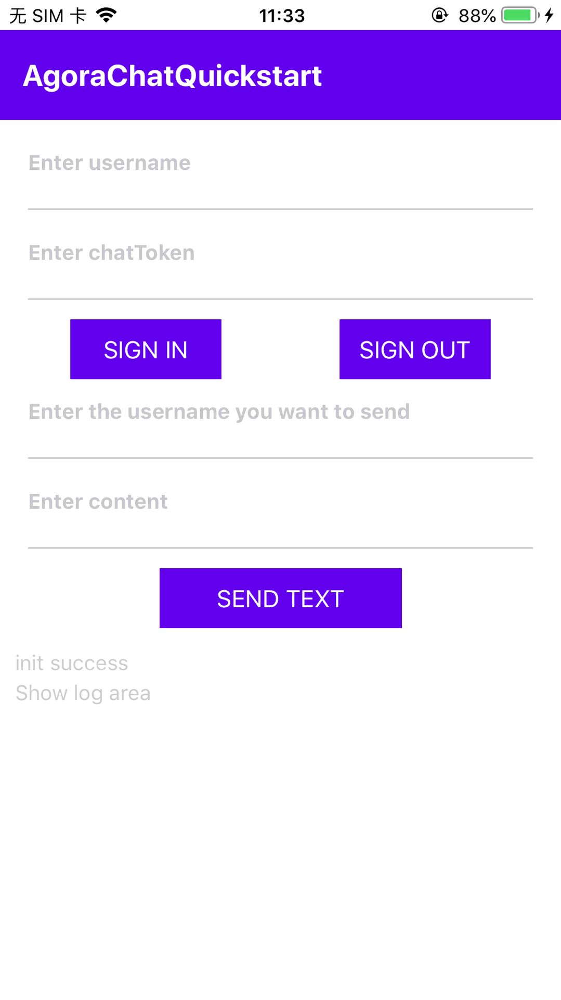

# API Example React-Native

_[中文](README.zh.md) | English_

## Introduction

This repository contains example projects using the Agora Chat React-Native sdk.



## project structure

This project implements multiple functions in a single app.

| Function                                  | Location           |
| ----------------------------------------- | ------------------ |
| Send and receive one-to-one text messages | [App.js](./App.js) |

## How to run the sample project

### Prerequisites

#### iOS

- MacOS 10.15.7 or above
- Xcode 12.4 or above, including command line tools
- React Native 0.63.4 or later
- NodeJs 16 or above, including npm package management tool
- CocoaPods package management tool
- Yarn compile and run tool
- Watchman debugging tool
- A physical or virtual mobile device running iOS 11.0 or later

#### Android

- MacOS 10.15.7 or above, Windows 10 or above
- Android Studio 4.0 or above, including JDK 1.8 or above
- React Native 0.63.4 or later
- CocoaPods package management tool if your operating system is Macos.
- Powershell 5.1 or above installed if your operating system is Windows.
- NodeJs 16 or above, including npm package management tool
- Yarn compile and run tool
- Watchman debugging tool
- A physical or virtual mobile device running Android 6.0 or later

### Running steps

Download the code from the repository and go to the `Chat-RN/quick_start_demo` directory.

```sh
git clone -b main git@github.com:AgoraIO/Agora-Chat-API-Examples.git
```

Initialize the project

```sh
yarn
```

Execute the pod manually (yarn usually executes it automatically)

```sh
cd ios && pod install
```

Update the latest SDK package (optional)

```sh
yarn upgrade react-native-agora-chat
```

Compile and run on real iOS device:

1. Connect the iPhone and set it to developer mode;
2. Open `token_login_demo/ios`, use `xcode` to open `token_login_demo.xcworkspace`;
3. Click **Targets** > **token_login_demo** > **Signing & Capabilities** to set the application signature under the signature option;
4. Click `Build` to build and run the project. After the program is built, it will be automatically installed and run, and the application interface will be displayed.

Compile and run on a real Android device:

1. Open `token_login_demo/android` in Android Studio;
2. Connect to Android phone, set to developer mode, and set USB adjustable;
3. Set data forwarding: enter `adb reverse tcp:8081 tcp:8081` in the terminal command line;
4. Start the service: execute the command in `package.json`: `"start": "react-native start"`, run the command `yarn start` in the terminal:

   ```sh
   yarn start
   ```

5. After the program is built, it will be installed and run automatically, and the application interface will be displayed.

## Feedback

If you have any questions or suggestions, you can give feedback in the form of an issue.

## Reference documentation

- [Agora Chat SDK Product Overview](https://docs.agora.io/en/agora-chat/agora_chat_get_started_rn?platform=React%20Native)
- [Agora Chat SDK API Reference](https://docs.agora.io/en/agora-chat/api-ref?platform=React%20Native)

## related resources

- You can first refer to [FAQ](https://docs.agora.io/cn/faq)
- If you want to know more official examples, you can refer to [Official SDK Examples](https://github.com/AgoraIO)
- If you want to understand the application of the AgoraIO SDK in complex scenarios, you can refer to [Official Scenario Case](https://github.com/AgoraIO-usecase)
- If you want to know the projects maintained by some community developers of Shengwang, you can check [Community](https://github.com/AgoraIO-Community)
- If you encounter problems and need developer help, you can go to [Developer Community](https://rtcdeveloper.com/) to ask questions
- If you need after-sales technical support, you can submit a ticket at [Agora Dashboard](https://dashboard.agora.io)

## Code License

The example project is under the MIT license.
