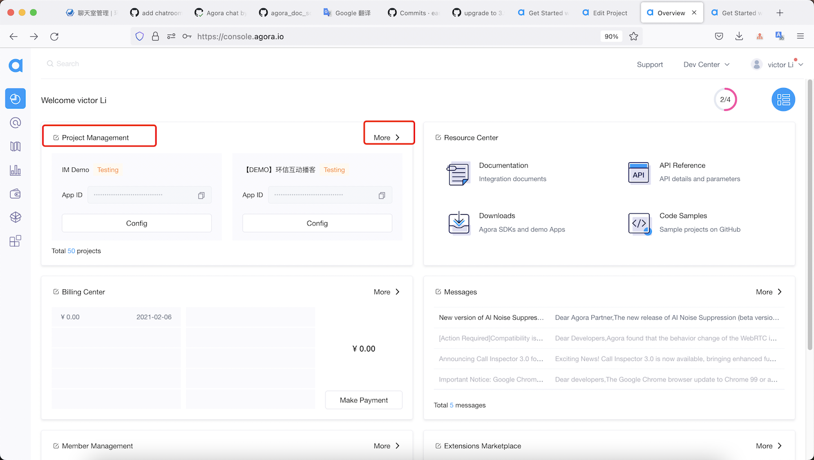
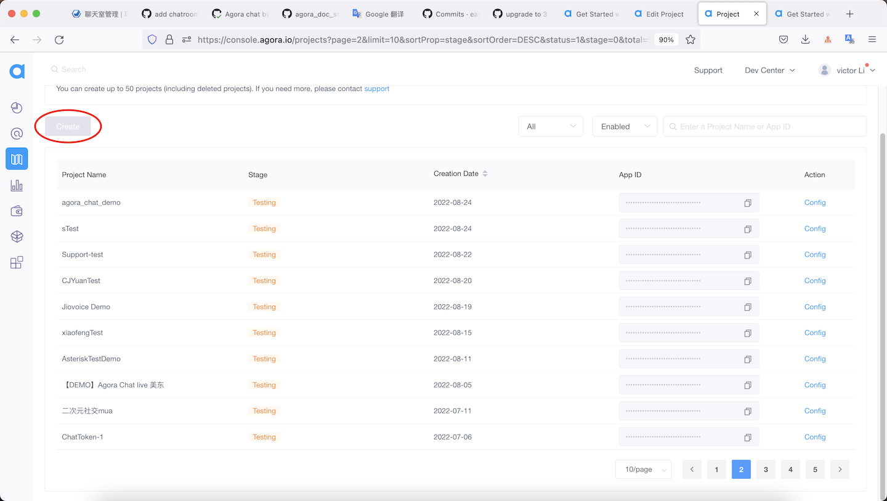
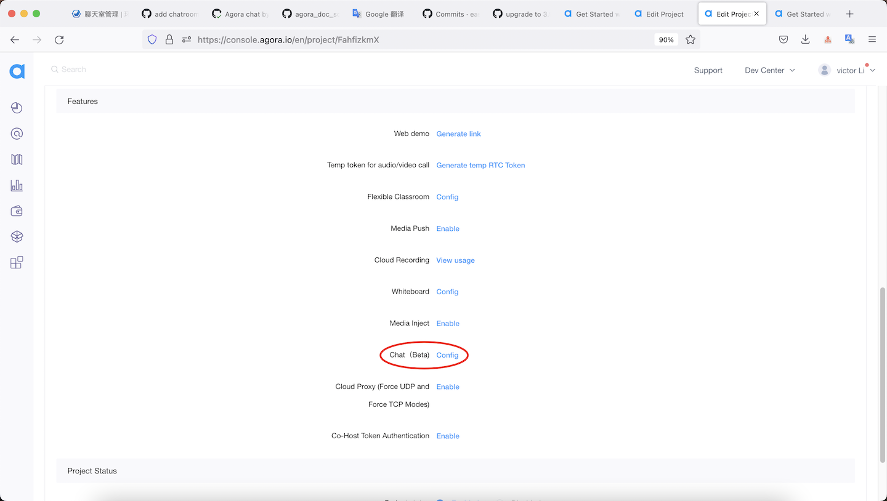
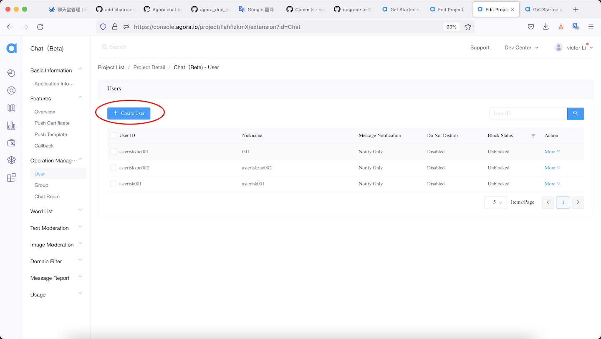
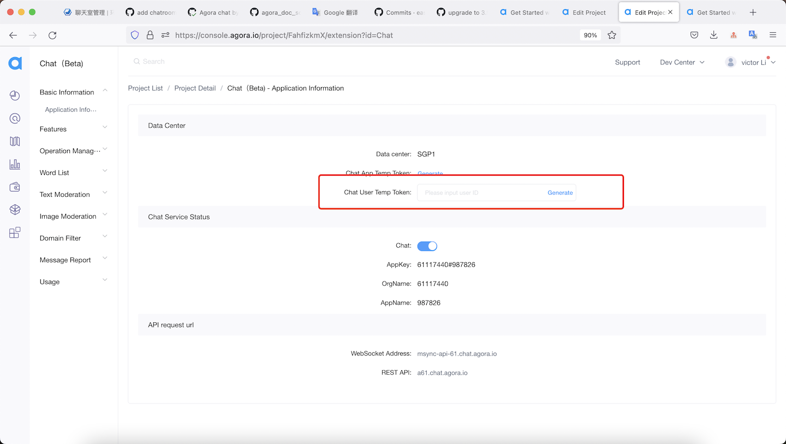

# API Example React-Native

_[English](README.md) | 中文_

## 简介

该仓库包含了使用 Agora Chat React-Native sdk 的示例项目。


##创建一个项目

1.进入控制台页面[agora.io](https://console.agora.io)。 2.进入项目管理页面。 3. 创建一个名为 `quick_start_demo` 的项目。




##注册一个用户

1.进入项目配置页面。 2.进入功能项中的聊天配置页面。
3、在运营管理项中创建用户。


## 生成用户令牌

1.进入项目配置页面。 2.进入功能项中的聊天配置页面。 3.在基本信息项中生成临时令牌。


## 项目结构

此项目使用一个单独的 app 实现了多种功能。

| 功能                     | 位置               |
| ------------------------ | ------------------ |
| 发送和接收一对一文本消息 | [App.js](./App.js) |

## 如何运行示例项目

### 前提条件

#### iOS

- MacOS 10.15.7 or above
- Xcode 12.4 or above, including command line tools
- React Native 0.63.4 or later
- NodeJs 16 or above, including npm package management tool
- CocoaPods package management tool
- Yarn compile and run tool
- Watchman debugging tool
- A physical or virtual mobile device running iOS 11.0 or later

#### Android

- MacOS 10.15.7 or above, Windows 10 or above
- Android Studio 4.0 or above, including JDK 1.8 or above
- React Native 0.63.4 or later
- CocoaPods package management tool if your operating system is Macos.
- Powershell 5.1 or above installed if your operating system is Windows.
- NodeJs 16 or above, including npm package management tool
- Yarn compile and run tool
- Watchman debugging tool
- A physical or virtual mobile device running Android 6.0 or later

### 运行步骤

从仓库下载代码，进入 `Chat-RN/quick_start_demo` 目录。

```sh
git clone -b main git@github.com:AgoraIO/Agora-Chat-API-Examples.git
```

初始化项目

```sh
yarn
```

手动执行 pod（yarn 一般会自动执行）

```sh
cd ios && pod install
```

更新最新 SDK 包(可选)

```sh
yarn upgrade react-native-agora-chat
```

编译并在 iOS 真机运行：

1. 连接苹果手机，设置为开发者模式；
2. 打开 `quick_start_demo/ios`，使用 `xcode` 打开 `quick_start_demo.xcworkspace`；
3. 依次点击 **Targets** > **quick_start_demo** > **Signing & Capabilities** 在签名选项下设置应用签名；
4. 点击 `Build` 构建并运行项目。程序构建完成后，自动安装和运行，并显示应用界面。

编译并在 Android 真机运行：

1. 在 Android Studio 中打开 `quick_start_demo/android`；
2. 连接 Android 系统手机，设置为开发者模式，并且设置 USB 可调式；
3. 设置数据转发：在终端命令行输入 `adb reverse tcp:8081 tcp:8081`；
4. 启动服务：执行 `package.json` 里面的命令：`"start": "react-native start"`，在终端中运行命令 `yarn start`：

   ```sh
   yarn start
   ```

5. 程序构建完成后，自动安装和运行，并显示应用界面。

## 反馈

如果你有任何问题或建议，可以通过 issue 的形式反馈。

## 参考文档

- [Agora Chat SDK 产品概述](https://docs.agora.io/en/agora-chat/agora_chat_get_started_rn?platform=React%20Native)
- [Agora Chat SDK API 参考](https://docs.agora.io/en/agora-chat/api-ref?platform=React%20Native)

## 相关资源

- 你可以先参阅[常见问题](https://docs.agora.io/cn/faq)
- 如果你想了解更多官方示例，可以参考[官方 SDK 示例](https://github.com/AgoraIO)
- 如果你想了解声网 SDK 在复杂场景下的应用，可以参考[官方场景案例](https://github.com/AgoraIO-usecase)
- 如果你想了解声网的一些社区开发者维护的项目，可以查看[社区](https://github.com/AgoraIO-Community)
- 若遇到问题需要开发者帮助，你可以到[开发者社区](https://rtcdeveloper.com/)提问
- 如果需要售后技术支持, 你可以在[Agora Dashboard](https://dashboard.agora.io)提交工单

## 代码许可

示例项目遵守 MIT 许可证。
