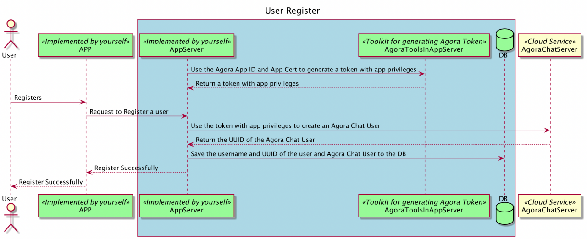
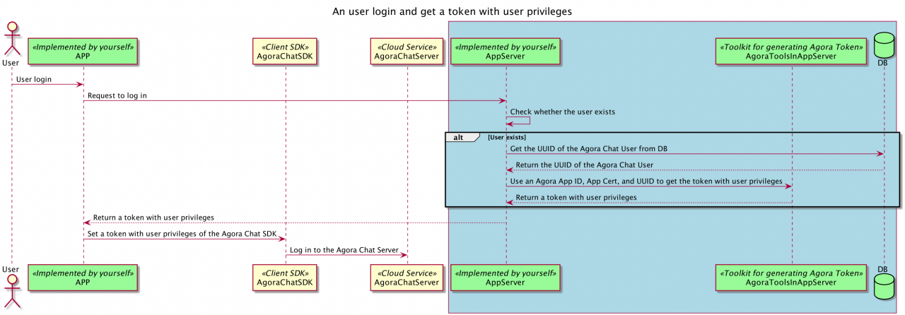

# Chat App Server

## Introduction

This repository contains sample project for chat app server, which include user registration and login.
When you plan to use agora chat service, you may need mapping your user profile with agora chat account and generate token for chat account. This project demonstrate how to create chat account and map to your own user profile and generate the token for chat account


* workflow for create account



---

* workflow for login



## Features

- App Server support user registration and will create a chat account and map it to the user.
- App Server support user login and generate a token for chat service(use aogra appId, appcert, chat user's uuid).
- App Server support store user information with database, which include account name, acount password, chat username and chat user's uuid.


## Technical

This project has been developed based on Django 4.1.2, using Python 3.8.

* [Django](https://www.djangoproject.com/)

## Components

* [AgoraTools](https://github.com/AgoraIO/Tools/tree/master/DynamicKey/AgoraDynamicKey) (Python3)
* SQLite

**Note**: By default, Django uses SQLite for storing data. However, for a better security and performance 
in production mode, we highly suggest to use other databases.
SQLite is not suitable for large scale applications.

## Prepare

Before you start, you need to prepare Agora chat appkey, agora AppId, Agora AppCert, and REST API domain.

* Setup Agora chat and get the AppKey：
  - Please login to Agora developer console, you can reference the link for detail. [Here](https://docs.agora.io/en/agora-chat/get-started/enable)

* You need setup your auth mechanism for your own user profile.

## Configure

Configure the below file with appkey, AppId, AppCert, and REST API domain you get from the above steps.

* The configuration file is [settings.py](./agora-app-server-django/chat_server/settings.py). At the end of the file,
replace the below values.

  ```
  ...
  
  # Agora-Chat configuration (your configuration here)
  AGORA_APP_ID = "<Your App ID>"  # Replace with your project App ID
  AGORA_APP_KEY = "<Your Chat App key>"  # Replace with your Chat feature App Key
  AGORA_APP_CERT = "<Your app certificate>"  # Replace with your project App Certificate
  AGORA_TOKEN_EXPIRE_PERIOD = 3600 * 24  # Token validity period in seconds, we don't suggest more than 24 hours

  # Your agora chat REST API domain (without https://).
  AGORA_REST_API_DOMAIN = "<Your REST API domain>"
      
  ```

## Run

After having setup the configuration, you need to prepare the app server.

### (Optional) Step 1: Create your virtual environment
1. Create your virtual environment with the below command in the project root.
```
python3 -m venv venv
```
This will create a folder named `venv`.

2. Activate the virtual environment.
   1. For Unix or Mac OS, run `source venv/bin/activate`
   2. For Windows, run `.\venv\Scripts\activate.bat`

### Step 2: Install the required dependencies
This app servers relies on Django 4.10 and the [Requests](https://requests.readthedocs.io/en/latest/) library.
You can install the required modules from the `requirements.txt` file.
```
pip install -r requirements.txt
```

### Step 3: Create the database
```
python3 manage.py migrate
```

### Step 4: Run the app server
```
python3 manage.py runserver
```

This will make the server run on the port `8000` by default. However, you are free to use another port, for example `python3 manage.py runserver 80` to run on port `80`.

## API

### Register user


This api is used to register a user for your app. User name and password is used in this sample project, you can use any other format for your user account ,such as phone number.

**Path:** `http://localhost:8000/app/user/register`

**HTTP Method:** `POST`

**Request Headers:** 

| Param        | description      |
| ------------ | ---------------- |
| Content-Type | application/json |
| Accept | application/json |

**Request Body example:** 
{"userAccount":"jack", "userPassword":"123"}

**Request Body params:** 

| Param        | Data Type | description   |
| ------------ | --------- | ------------- |
| userAccount  | String    | user account  |
| userPassword | String    | user password |


**request example:**

```
curl -X POST -H 'Content-Type: application/json' -H 'Accept: application/json' 'http://localhost:8000/app/user/register' -d '{"userAccount": "jack","userPassword":"123"}'
```

**Response Parameters:**

| Param           | Data Type | description          |
| --------------- | --------- | -------------------- |
| code            | Int    | response status code |

**response example:**

```json
{
    "code": 200
}
```

---

### User Login

User login on your app server and get a agora token for chat service.

**Path:** `http://localhost:8000/app/user/login`

**HTTP Method:** `POST`

**Request Headers:** 

| Param        | description      |
| ------------ | ---------------- |
| Content-Type | application/json |
| Accept | application/json |

**Request Body example:** 
{"userAccount":"jack", "userPassword":"123"}

**Request Body params:** 

| Param        | Data Type | description   |
| ------------ | --------- | ------------- |
| userAccount  | String    | user account  |
| userPassword | String    | user password |

**request example:**

```
curl -X POST -H 'Content-Type: application/json' -H 'Accept: application/json' 'http://localhost:8000/app/user/login' -d '{"userAccount": "jack","userPassword":"123"}'
```

**Response Parameters:**

| Param           | Data Type | description                |
| --------------- | --------- | -------------------------- |
| code            | Int    | response status code       |
| accessToken     | String    | token                      |
| expireTimestamp | Long      | timestamp for token expire |
| chatUserName | String    | chat user id               |

**response example:**

```json
{
    "code": 200,
    "accessToken": "xxx",
    "expireTimestamp": 1628245967857,
    "chatUserName": "jack"
}
```
---

### Get token

Get a token including user and rtc privileges.

**Path:** `http://localhost:8000/token`

**HTTP Method:** `GET`

**Request Headers:** 

| Param        | description      |
| ------------ | ---------------- |
| Accept | application/json |

**Request Body example:** 
{"userAccount":"jack", "userPassword":"123"}

**Request params:** 

| Param        | Data Type | description   | required |
| ------------ | --------- | ------------- | -------- |
| userAccount  | String    | user account  |    Yes   |
| channelName  | String    | channel name  |    Yes   |
| publisherRole  | Boolean    | whether the rtc privileges is the publisher role, the default is false   |    No    |

**request example:**

```
curl -X GET -H 'Accept: application/json' 'http://localhost:8000/token?userAccount={userAccount}&channelName={channelName}&publisherRole=true'
```

**Response Parameters:**

| Param           | Data Type | description                |
| --------------- | --------- | -------------------------- |
| code            | Int    | response status code       |
| accessToken     | String    | token                      |
| expireTimestamp | Long      | timestamp for token expire |
| chatUserName | String    | chat user id               |
| agoraUid | String    | agora uid              |

**response example:**

```json
{
    "code": 200,
    "accessToken": "xxx",
    "expireTimestamp": 1628245967857,
    "chatUserName": "jack",
    "agoraUid": "12356"
}
```
