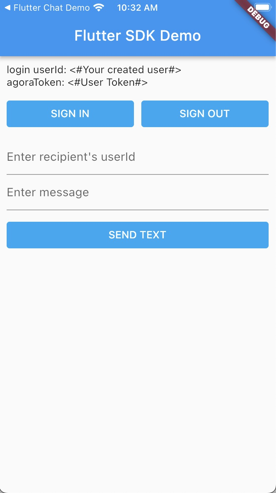

# API Example flutter

_[English](README.md) | 中文_

## 简介

该仓库包含了使用 Agora Chat flutter sdk 的示例项目。



## 项目结构

此项目使用一个单独的 app 实现了多种功能。

| 功能| 位置 |
| --- | --- |
| 发送和接收一对一文本消息 | [main.dart](https://github.com/AgoraIO/Agora-Chat-API-Examples/blob/main/chat_flutter/lib/main.dart)                  |

## 如何运行示例项目

### 前提条件

#### iOS

- Flutter 2.10 or later
- Dart 2.16 or later
- macOS
- Xcode 12.4 or later with Xcode Command Line Tools
- CocoaPods
- 真实的 iOS 设备或 iOS 虚拟机

#### Android

- Flutter 2.10 or later
- Dart 2.16 or later
- macOS or Windows
- Android Studio (推荐最新版)
- JDK (1.8以上)
- 真实的 Android 设备或 Android 虚拟机 安卓21或以上版本

**注意** 安卓需要的权限已经在sdk中添加。
```xml
<uses-permission android:name="android.permission.INTERNET" />
<uses-permission android:name="android.permission.ACCESS_NETWORK_STATE"/>
<uses-permission android:name="android.permission.WAKE_LOCK"/>
<uses-permission android:name="android.permission.SCHEDULE_EXACT_ALARM"/>
```

### 运行步骤

1. 克隆本项目到本地;
2. 进入到项目目录 `chat_flutter`;
3. 执行 `flutter pub get`;
4. 如果你想使用自己的 App Key 进行体验，你可以编辑 `chat_flutter/lib/main.dart` 文件。
   - 将 `AgoraChatConfig.appKey` 替换为你的 App Key。
   - 将 `AgoraChatConfig.userId` 替换为你注册的userId。
   - 将 `AgoraChatConfig.agoraToken` 替换为你userId对应的agoraToken。


   > 参考 [开启和配置即时通讯服务](https://docs.agora.io/cn/agora-chat/enable_agora_chat?platform=flutter) 了解如何开启并配置即时通讯服务。

   > 参考源码 [Chat App Server](https://github.com/AgoraIO/Agora-Chat-API-Examples/tree/main/chat-app-server) 了解如何快速搭建 App Server。


5. 构建项目，在虚拟器或真实 Android / iOS 设备中运行项目。

一切就绪。你可以自由探索示例项目，体验 SDK 的丰富功能。

## 反馈

如果你有任何问题或建议，可以通过 issue 的形式反馈。

## 参考文档

- [Agora Chat SDK 产品概述](https://docs.agora.io/en/agora-chat/agora_chat_get_started_flutter?platform=Flutter)
- [Agora Chat SDK API 参考](https://docs.agora.io/en/agora-chat/api-ref?platform=Flutter)

## 相关资源

- 你可以先参阅[常见问题](https://docs.agora.io/cn/faq)
- 如果你想了解更多官方示例，可以参考[官方 SDK 示例](https://github.com/AgoraIO)
- 如果你想了解声网 SDK 在复杂场景下的应用，可以参考[官方场景案例](https://github.com/AgoraIO-usecase)
- 如果你想了解声网的一些社区开发者维护的项目，可以查看[社区](https://github.com/AgoraIO-Community)
- 若遇到问题需要开发者帮助，你可以到[开发者社区](https://rtcdeveloper.com/)提问
- 如果需要售后技术支持, 你可以在[Agora Dashboard](https://dashboard.agora.io)提交工单

## 代码许可

示例项目遵守 MIT 许可证。
