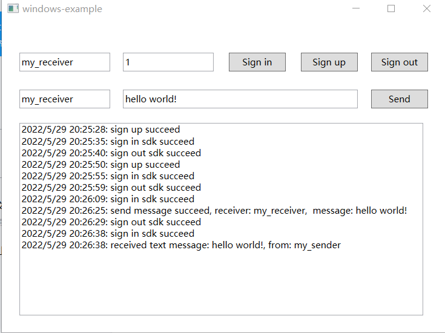

# API Example Windows

_English | [ÖÐÎÄ](README.zh.md)_

## Overview

This repository contains sample projects using the Agora Chat Windows sdk.

## Project structure

The project uses a single app to combine a variety of functionalities.

| Function   | Location  |
| --------------- | ------------------------ |
| Get Started with Agora Chat Windows sdk |https://github.com/AgoraIO/Agora-Chat-API-Examples/blob/main/windows-example/MainWindow.xaml.cs |

## How to run the sample project

### Prerequisites

*Necessary requirements for the project to run.*

- *A Windows device running Windows 10 or later*
- *Visual Studio IDE 2019 or later*
- *.Net Framework 4.5.2 or later*

### Steps to run

1. *Clone this project to local*
2. *Using visual studio to open project: windows-example\windows-example.sln*
3. *Integrate Agora Chat Windows sdk*
   > DownLoad [ Agora Chat Windows SDK](https://downloadsdk.easemob.com/downloads/SDK/WinSDK/agora_chat_sdk.1.0.2.1-beta.nupkg)

   > Install the nupkg from local directory(need to check the Include prerelease box).

4. *Add sample code for this project*

   > This project only include a framework which has no implementations.
   Need to add sample code. See [Get Started with Agora Chat Windows sdk](https://docs.agora.io/en/null/agora_chat_get_started_windows?platform=Windows)

5. *Compile, run and test the project*

You are all set! Feel free to play with this sample project and explore features of the Agora Chat Windows SDK.

## Feedback

If you have any problems or suggestions regarding the sample projects, feel free to file an issue.

## Reference

- [Agora Chat Windows SDK Product Overview](https://docs.agora.io/en/agora-chat/agora_chat_overview?platform=Windows)
- [Agora Chat Windows SDK API Reference](https://docs.agora.io/en/agora-chat/api-ref?platform=Windows)

## Related resources

- Check our [FAQ](https://docs.agora.io/en/faq) to see if your issue has been recorded.
- Dive into [Agora SDK Samples](https://github.com/AgoraIO) to see more tutorials
- Take a look at [Agora Use Case](https://github.com/AgoraIO-usecase) for more complicated real use case
- Repositories managed by developer communities can be found at [Agora Community](https://github.com/AgoraIO-Community)
- If you encounter problems during integration, feel free to ask questions in [Stack Overflow](https://stackoverflow.com/questions/tagged/agora.io)

## License

The sample projects are under the MIT license.
